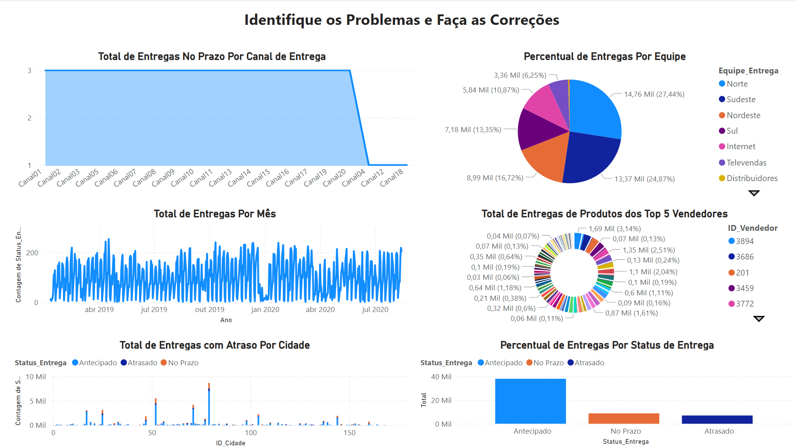
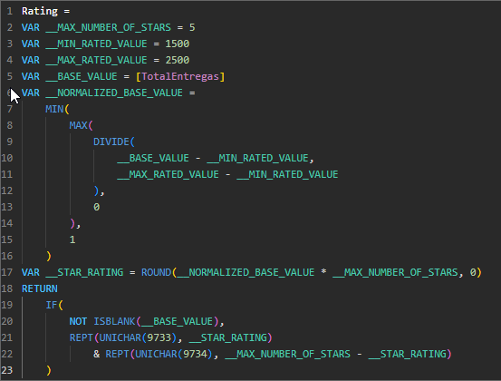
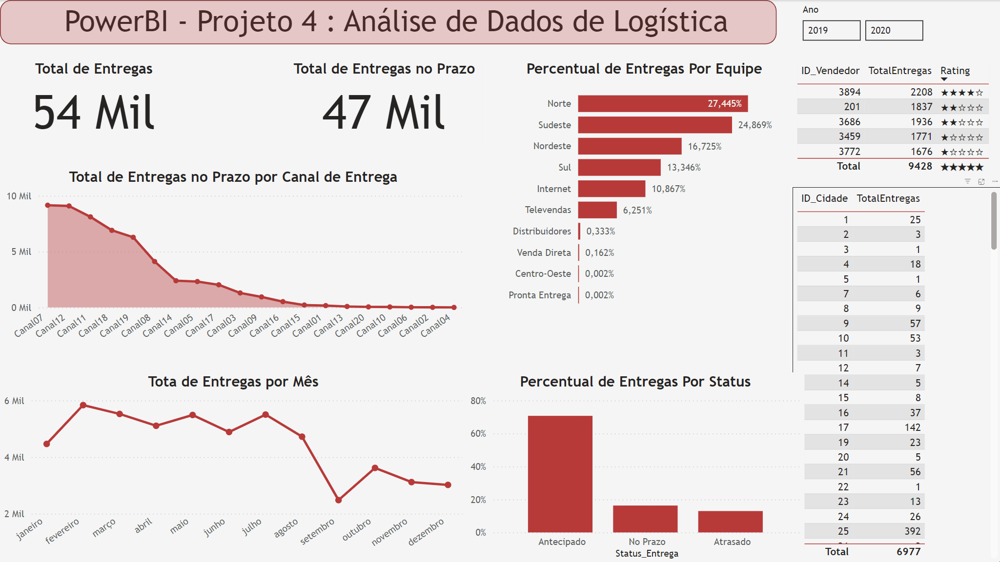
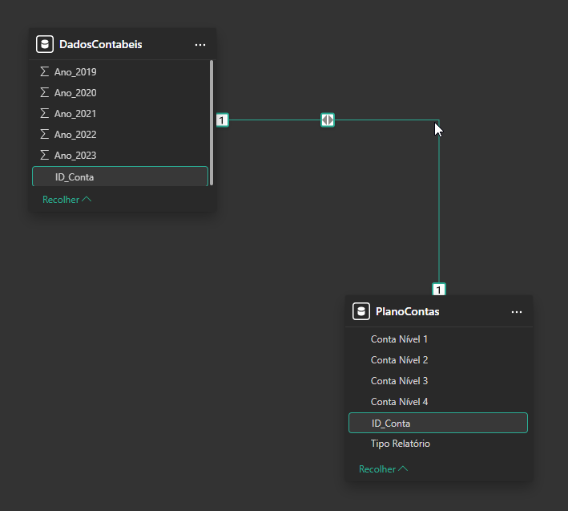
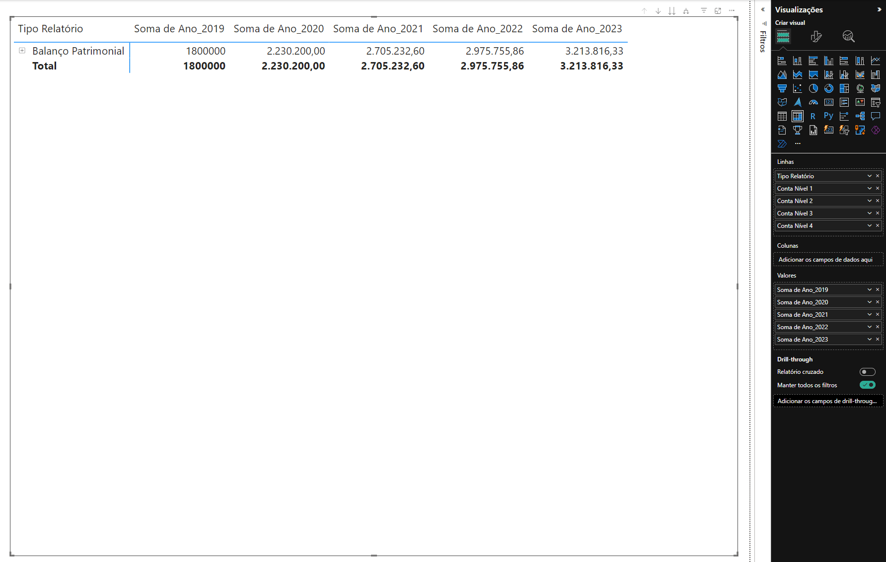
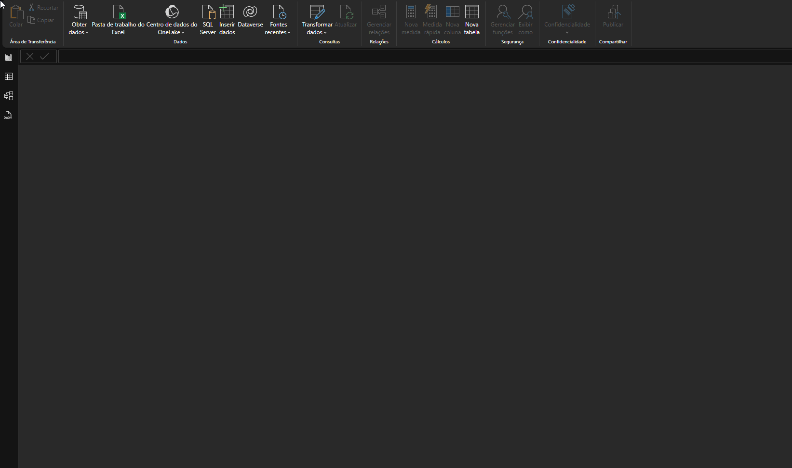
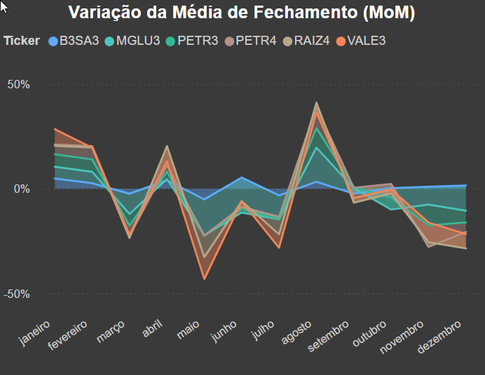
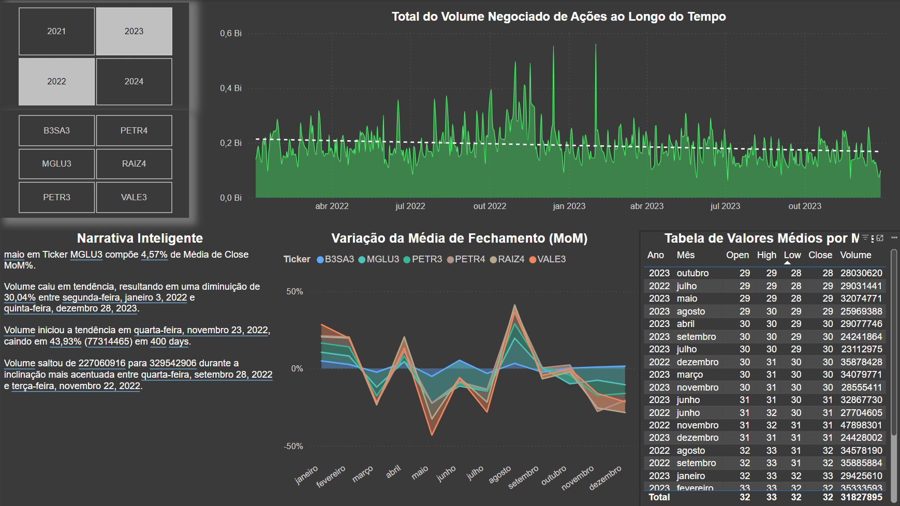

<div align="center">
  
  
</div>


Este repositório compila uma série de projetos didáticos realizados durante a primeira metade do curso **"Microsoft Power BI Business Intelligence e Data Science"** da [Data Science Academy](https://www.datascienceacademy.com.br/) (72 horas de conteúdo, nível intermediário); esta primeira metade é focada em funcionalidades do Power BI, como:
1. Ferramentas de visualização;
2. Linguagem M para processos de ETL;
3. Linguagem DAX para criação de medidas, estatísticas e parâmetros auxiliares;
4. Manipulação de dados com Power Query;
5. Funcionalidades nativas e externas e.g. _Bravo_ e _DAX Studio_.


A segunda metade do curso é contemplada [neste repositório irmão](https://github.com/hbatistuzzo/Projetos_PowerBI_parte2), o qual trata da interação do Microsoft Power BI com outras aplicações; em particular:
1. A integração do Power BI com Bancos de Dados;
2. O uso de SQL Analytics;
3. A aplicação de técnicas de _Machine Learning_ para segmentação e detecção de anomalias;
4. O uso de Inteligência Artificial para análise de séries temporais no Power BI; e
5. Um estudo de caso. A oportunidade é fortuita para o aprendizado de algumas aplicações acessórias como ODBC e SQLite.

Há ainda [um terceiro repositório irmão](https://github.com/hbatistuzzo/advanced_PowerBI_with_DAX), de estrutura semelhante, o qual organiza o conteúdo do curso "Power BI Avançado para Análise de Dados com DAX" (70 horas, nível avançado). 

Em conjunto, estes 3 repositórios compreendem um exercício didático, ao mesmo tempo em que permitem a criação de um portfolio onde a ferramenta é utilizada para a solução de problemas em diferentes cenários (marketing, logística, finanças, contabilidade, etc).

---

<h1 align="center">Projeto 1: Análise de Dados de Marketing</h1>

🔹Interaja com o [Dashboard online aqui](https://app.powerbi.com/groups/me/reports/7548fe13-3b4f-4c28-b25c-419bf9f7ccbd/696ea71078306cadd58c?experience=power-bi)

<details>
<summary>Contexto</summary>

Existem muitos indicadores de Marketing diferentes que as empresas podem usar para medir o sucesso de suas estratégias e campanhas. Alguns dos principais indicadores incluem:

1. *Taxa de conversão*: A proporção de visitantes do site que realizam uma ação desejada, como comprar um produto ou preencher um formulário de contato.

2. *Taxa  de  retenção  do  cliente*: A proporção de clientes que compram de uma empresa novamente.

3. *Custo por aquisição de cliente (CAC)*: O custo total de adquirir um novo cliente, incluindo despesas com publicidade e marketing.

4. *Retorno sobre investimento (ROI)*: O lucro ou prejuízo obtido em relação ao investimento feito em uma campanha de marketing.

5. *Conscientização da marca*: A medida da familiaridade e reconhecimento da marca entre o público-alvo.

6. *Engajamento*: A medida da interação dos usuários com conteúdo, campanhas e canais de marketing.

7. *Net  Promoter  Score  (NPS)*: Uma  medida  da  lealdade  dos  clientes,  baseada  em  sua disposição para recomendar uma 
empresa ou produto para outras pessoas.

8. *Tráfego do website*: Número de visitas no website.

Esses  indicadores  devem  ser  monitorados  regularmente  para  ajudar  as  empresas  a entender  o  sucesso  de  suas  estratégias  e  campanhas  de  marketing  e  fazer  ajustes  onde necessário.Além disso é importante compreender o perfil dos clientes, o comportamento de gastos e os padrõesde compra de acordo com diferentes métricas.

</details>

## Construção do Dashboard
O objetivo geral do projeto é gerar insights para uma equipe de marketing através de uma série de informações estruturadas no arquivo dados_marketing.csv:

- O perfil de clientes de uma empresa fictícia (idade, escolaridade, nacionalidade, número de filhos, etc);
- Os respectivos gastos de cada cliente em diferentes setores (alimentação, vestuário, utilidades, móveis, etc);
- O número de compras realizadas por via (catálogos, web, lojas físicas) e booleanos caracterizando se compras ocorreram durante determinada campanha de marketing.

São criados, portanto, diversos relatórios divididos em 4 visões:
1. Visão do Cliente;
2. Visão do Comportamento de Compra do Cliente;
3. Visão da Performance das Campanhas de Marketing;
4. Visão dos Padrões de Compra no Ponto de Venda (País)

Para cada visão trabalha-se a análise dos dados, a criação de gráficos e medidas, a extração de métricas e o cruzamento entre os dados, visando entregar aos tomadores de decisão uma visão bastante completa sobre o perfil dos clientes, os padrões de compra e a efetividade das campanhas de Marketing.

## Visão Cliente


Visão focada no perfil de 2000 clientes distintos, separados por escolaridade,, estado civil e país.
- Total de Clientes por Escolaridade: A maioria dos clientes possui curso superior, seguido por doutorado e mestrado, com menores números para segundo e primeiro grau.
- Total de Clientes por Estado Civil: A maior parte dos clientes é solteira, seguida por casados e divorciados.
- Países: quase metade do total de clientes residem nos Estados Unidos

---

## Comportamento de Gastos do Cliente


A segunda página do relatório foca no comportamento de gasto do cliente.

- Gráficos de Dispersão e Barras: o gráfico de dispersão mostra uma correlação positiva entre o salário anual e o total de gastos dos clientes. A maioria dos clientes com menor salário também tem gastos menores, enquanto aqueles com salários mais altos tendem a gastar mais.
- Filtros: há filtros para Estado Civil e Escolaridade, que possibilitam segmentar o total de gastos.
- Total de Gastos x Filhos em Casa: A maior parte do total de gastos provém de clientes que não possuem filhos em casa, seguido por aqueles com 1 ou 2 filhos.
- Total de Gastos x Adolescentes em Casa: Clientes que não têm adolescentes em casa representam a maior parte dos gastos. O gasto diminui à medida que o número de adolescentes em casa aumenta.

Esse layout oferece uma análise sobre como fatores demográficos, como a presença de filhos ou adolescentes, influenciam o comportamento de consumo dos clientes.

---

## Performance das Campanhas


A terceira página do relatório foca na performance das campanhas de marketing.

- Efetividade da Campanha x Número de Filhos: Este gráfico de barras mostra a relação entre o número de filhos em casa e a adesão à campanha (compra). Clientes sem filhos tiveram uma taxa de compra maior, enquanto a taxa de compra diminui conforme aumenta o número de filhos.
- Resultado das Campanhas de Marketing: O gráfico de pizza mostra que 84% dos clientes não compraram (1,68 mil), enquanto 16% dos clientes compraram (0,32 mil), indicando que a campanha atingiu uma minoria dos clientes.
- Compras x Escolaridade: A tabela detalha o número de compras de acordo com o nível de escolaridade. Nota-se que clientes com curso superior e doutorado estão mais presentes na categoria "Não comprou", enquanto há menor participação de pessoas com níveis educacionais mais baixos.
- Média de Salário Anual x Resultado das Campanhas: Este gráfico compara a média de salário anual entre clientes que compraram e não compraram. A média salarial dos que compraram é de 59 mil, enquanto a dos que não compraram é de 51 mil, indicando que a campanha foi mais efetiva entre aqueles com maior renda.

Esses dados fornecem uma visão sobre quais segmentos de clientes responderam melhor às campanhas e sugerem que o nível educacional e a renda são fatores que influenciam a adesão.

---

## Padrões de Compra por Ponto de Venda


A quarta e última página do relatório foca na separação de vendas e gastos por categoria nos diferentes países. 

- Total Gasto em Diferentes Categorias por País: A linha de tendência sugere que os Estados Unidos têm os maiores gastos por categoria, seguido de uma queda acentuada nos países seguintes.
- Total de Gastos por Ano e País: É um gráfico de linhas que mostra a evolução do total de gastos por ano, de 2018 a 2023, para os países contemplados. Novamente os Estados Unidos destacam-se com um crescimento contínuo e mais expressivo. Outros países, como Espanha, Chile e Alemanha, mostram uma tendência de estabilidade ou crescimento menor.

---
---
---

<h1 align="center">Projeto 2: Análise de Dados Comerciais</h1>

🔹Interaja com o [Dashboard online aqui](https://app.powerbi.com/groups/me/reports/63750961-66c0-4a63-8ba8-f18362d86e70/c20d8fd6d156d5a5042b?experience=power-bi)

<details>
<summary>Contexto</summary>

Os principais KPIs (Key Performance Indicators) da área comercial são indicadores que medem o desempenho e a eficiência das atividades de vendas. Alguns dos KPIs mais comuns incluem:

1. *Volume de vendas*: quantidade de produtos ou serviços vendidos;
2. *Ticket médio*: valor médio das vendas por transação;
3. *Taxa  de  conversão*:  proporção  de  visitantes  do  site  ou  contatos  que  se  tornam clientes;
4. *Ciclo  de  vendas*: tempo médio que leva para fechar uma venda, desde o primeiro contato com o cliente até o fechamento;
5. *Retenção  de  clientes*:  taxa  de  clientes  que  compram  novamente  após  a  primeira compra;
6. *Lucratividade*: receita líquida obtida pela venda de produtos ou serviços, descontados os custos;
7. *Produtividade da equipe de vendas*: quantidade de vendas realizadas por vendedor por período; e
8. *Satisfação do cliente*: medida da satisfação dos clientes com a empresa, produtos e serviços oferecidos.

Estes KPIs ajudam a identificar pontos fortes e fracos na estratégia de vendas da empresa, e permitem tomar decisões mais informadas para melhorar o desempenho da área comercial.

</details>

## Construção do Projeto

O arquivo Dados_Comerciais.xlsx contém uma lista de transações comerciais realizadas por uma empresa, descrevendo a venda de produtos separados por categoria, segmento comercial, loja, localização, vendedor, comissão, data da transação, valores e custos, etc.

- Este dashboard inclui um índice dinâmico, cuja funcionalidade é exibidade abaixo:

---

## Narrativa Inteligente


- A narrativa inteligente é um recurso do PowerBI que gera automaticamente um texto corrido para sublinhhar os principais pontos-chave provenientes das demais visualizações na página. Note que a filtragem dinâmica que é rotineiramente utilizada nas visualizações do PowerBI também se reflete na narrativa inteligente.

---

## Principais Influenciadores de Vendas


- O recurso visual de "Principais Influenciadores" do PowerBI automaticamente analisa o valor das vendas em função de variáveis categóricas (no caso, Categoria e Segmentos). Em poucos passos chega-se à conclusão de que o segmento "Corporativo" e a categoria de "Celulares" são os principais responsáveis por influenciar o aumento na variável "ValorVenda".
- Modificando-se o checkbox de "Aumentar" para "Diminuir" gera uma nova análise, análoga, detalhando que o segmento "Doméstico" e a categoria "Eletroportáteis" são os maiores responsáveis por influenciar a diminuição na variável "ValorVenda".
- A análise é convenientemente acompanhado de um gráfico de barras, também gerado automaticamente, o qual se adapta caso o foco da análise seja por categoria ou por segmento.

---

## Faixas de Vendas


- A visualização de Gráfico de Faixas exibe a queda (ou aumento) nas vendas de uma determinada categoria para outra em um determinado ponto de venda. Dentre outras caracaterísticas, esse gráfico possui a vantagem de detalhar instantaneamente se determinadas lojas performaram melhor em quais categorias. Essa relação nem sempre é monotônica (e.g. o ponto de venda SP8821 performa razoavelmente bem na venda de Eletrodomésticos, em terceiro lugar dentre as lojas, mas falha grosseiramente na venda de celulares).
- É relevante observar que estas mesmas informações poderiam ser dispostas de forma tabular com a visualização matricial. O gráfico de faixas, porém, provê um auxílio visual ao destacar as diferentes proporções no volume de vendas entre as categorias de produtos. Mais do que isso, a funcionalidade do "Controle Deslizante" permite ao usuário customizar a visualização,caso seja necessário, por exemplo, investigar as variações para lojas cujo volume de vendas é muito menor comparada àquelas que dominam o mercado.

---

## Performance dos Vendedores por Região


Por fim, a visualização por mapa permite investigar informações de venda por Estados ou Cidades. No caso, vendas de determinados vendedores são exibidos para certos estados. Um filtro dinâmico pode ser aplicado caso queiramos discernir, por exemplo, quais foram os vendedores cujo volume de vendas excedeu 30000 unidades.

---
---
---

<h1 align="center">Projeto 3: Análise de Dados de RH</h1>

🔹Interaja com o [Dashboard online aqui](https://app.powerbi.com/groups/me/reports/a74ae509-efd2-432b-8d4d-149af4a77f22/f04bd35605564bf39cd5?experience=power-bi)

<details>
<summary>Contexto</summary>

A área de Recursos Humanos (RH) tem como função principal gerenciar e administrar as atividades relacionadas ao pessoal de uma empresa, a fim de promover o desenvolvimento e a satisfação dos funcionários e, consequentemente, contribuir para o sucesso da organização. Neste contexto, alguns dos principais KPIs incluem:

1. *Taxa  de  rotatividade*:  mede  a  frequência  com  que  os  funcionários  estão  deixando  a empresa, o  que  pode  indicar  problemas  com  o  ambiente  de  trabalho,  remuneração  ou oportunidades de desenvolvimento;

2. *Satisfação do funcionário*: mede o grau de satisfação dos funcionários com relação ao trabalho, remuneração, ambiente de trabalho e oportunidades de desenvolvimento;

3. *Tempo médio para preenchimento de vagas*: mede o tempo necessário para preencher uma vaga aberta, o que pode indicar a eficiência do processo de recrutamento e seleção;

4. *Custo  de  contratação  por  funcionário*:  mede  o  custo  total  de  contratar  um  novo funcionário, incluindo gastos com anúncios de vagas, entrevistas, testes e treinamento;

5. *Participação  em  treinamentos*:  mede  o  número  de  funcionários  que  participam  de programas de treinamento e desenvolvimento, o que pode indicar o interesse dos funcionários em melhorar suas habilidades e desenvolver suas carreiras;

6. *Avaliação de desempenho*: mede a avaliação do funcionário em um ciclo de trabalho, normalmente 6 meses ou 12 meses;

7. *Nível de absenteísmo*: mede a frequência com que os funcionários faltam ao trabalho, o que pode indicar problemas com o ambiente de trabalho ou saúde dos funcionários;

8. *Nível  de  engajamento*:  escala  que  define  quão  engajados  os  funcionários estão, normalmente medida com base  no nível de absenteísmo, pontualidade, avaliação de desempenho, etc.

</details>

## Construção do Projeto

O arquivo DatasetRH.csv contém as características de funcionários fornecidos pelo setor RH de uma empresa: gênero, idade, salário, anos sem promoção, etc.

O objetivo deste projeto é focar na manipulação dos dados com o editor do PowerQuery e o uso de expressões DAX. Novas colunas condicionais são criadas para auxiliar na produção de visualizações, bem como medidas de interesse (as quais ao final do projeto configuram uma nova tabela, "Medidas"). As atividades reforçam a vantagem de se manter uma série de medidas arquivadas, para uso quando necessário, ao invés da simples visualização instantânea no dashboard. A sintaxe DAX oferece uma série de funções para os mais diversos tipos de cálculo: AVERAGE, DIVIDE, CALCULATE, COUNTROWS, etc; a sintaxe de uso é similar a de outras bibliotecas de análise e tratamento de dados, como Pandas, embora a interface gráfica remeta ao Excel clássico.

### Visualização única


Como não há necessidade de storytelling para as informações fornecidas neste contexto, opta-se por um único dashboard, com informações-chave dispostas em diferentes cartões. Poucos gráficos de baixa complexidade podem coexistir nesse ambiente único sem poluir muito a visualização. Destaca-se também a versatilidade da formatação visual no PowerBI: com alguns poucos cliques pode-se alterar rapidamente a disposição entre os elementos, ou a paleta de cores utilizada. Um dashboard com as mesmas informações e formatação similar é exibido abaixo:


---
---
---

<h1 align="center">Projeto 4: Análise de Dados de Logística</h1>

🔹Interaja com o [Dashboard online aqui](https://app.powerbi.com/groups/me/reports/f963b56e-cd75-4036-a859-52f88926d6b5/c7dea9e2ac138de38600?experience=power-bi)

<details>
<summary>Contexto</summary>

A área de logística tem a função de gerenciar o fluxo de produtos e informações desde o ponto de origem até o destino final, de forma eficiente e econômica. Isso inclui a coordenação de várias atividades, como o transporte, armazenamento, distribuição, embalagem, gerenciamento de estoque e o gerenciamento da cadeia de suprimentos. 

A logística é fundamental para a operação bem-sucedida de muitas empresas, pois pode afetar diretamente a satisfação do cliente, a produtividade, a eficiência operacional e os custos. Ao gerenciar a cadeia de suprimentos de forma eficaz, a área de logística pode garantir que as mercadorias estejam disponíveis no momento certo, no lugar certo e nas  condições adequadas, além de otimizar os recursos e minimizar os custos.

Além disso, a área de logística pode ajudar a empresa a identificar oportunidades para melhorar sua operação, 
reduzir desperdícios, aumentar a eficiência e reduzir o tempo de ciclo do pedido (do pedido até a entrega ao cliente ou 
destino). Com a crescente complexidade dos negócios e a globalização da economia, a importância da logística tem aumentado 
significativamente, tornando-se um fator crítico de sucesso para muitas empresas.

Um exemplo de como a área de logística pode ser fundamental para a operação bem-sucedida de uma empresa é o caso de uma loja virtual de roupas que vende para clientes em todo o país. Para garantir que seus clientes recebam seus pedidos no prazo e em perfeitas condições, 
a empresa precisa gerenciar efetivamente o transporte, armazenamento e distribuição de seus produtos. Isso inclui a coordenação com fornecedores, gerenciamento de estoque, embalagem, escolha de transportadoras, rastreamento de pedidos e gerenciamento de devoluções.Se a empresa não gerenciar essas atividades de forma eficaz, pode haver atrasos na entrega,  produtos danificados,  aumento  dos  custos  de  transporte  e  armazenamento  e 
insatisfação do cliente. Além disso, a empresa pode enfrentar problemas de estoque excessivo ou insuficiente, o que pode levar a perdas financeiras.

Por outro lado, se a área de logística da empresa gerenciar essas atividades de forma eficaz, poderá garantir que os produtos sejam entregues no prazo, em perfeitas condições e a um custo razoável. Isso pode levar a uma melhor satisfação do cliente, redução de custos e aumento da receita.

Existem vários indicadores-chave de desempenho (KPIs) que podem ser usados para medir a eficácia e a eficiência da área de logística de uma empresa. Alguns dos principais KPIs incluem:

1. *Tempo de ciclo*: o tempo necessário para atender um pedido, desde o momento em que é feito até o momento em que é entregue ao cliente.

2. *Taxa  de  entrega  no  prazo*:  a  porcentagem  de  pedidos  entregues  dentro  do  prazo acordado.

3. *Custo  de  transporte*:  o  custo  médio  por  unidade  ou  por  pedido  para  transportar  os produtos.

4. *Nível de estoque*: o número de dias ou semanas de suprimento de estoque disponível.

5. *Taxa de devolução*: a porcentagem de pedidos devolvidos pelos clientes.

6. *Índice de acurácia de estoque*: a precisão do estoque registrado em relação ao estoque real.

7. *Taxa de utilização de armazenamento*: a porcentagem do espaço de armazenamento disponível que está sendo utilizado.

8. *Nível  de  serviço  ao  cliente*:  a  satisfação  geral  do  cliente  com  o  serviço  de  logística, 
incluindo tempo de entrega, qualidade do produto eatendimento ao cliente.

9. *Taxa de ocorrência de avarias*: a porcentagem de produtos que sofrem danos durante o transporte ou armazenamento.

10. *Índice  de  retorno  sobre  investimento  (ROI)*:  o  retorno  financeiro  gerado  pelos investimentos  em  logística, como  sistemas  de  gerenciamento  de  armazéns  ou  software  de rastreamento de pedidos.

</details>

## Construção do Projeto

Este projeto foca em solucionar os problemas de um dashboard .pbix construído previamente por um analista de dados sem experiência.

<div align="center">
  
  
</div>

---

### Resolução

O Dashboard precisava mostrar os seguintes KPIs de Logística:
1. Total de Entregas no Prazo Por Canal de Entrega
2. Percentual de Entregas Antecipadas Por Equipede Entrega
3. Total de Entregas Por Mês
4. Total de Entregas de Produtos dos Top5 Vendedores
5. Total de Entregas com Atraso Por Cidade
6. Percentual de Entregas Por Status de Entrega

---

## Total de Entregas no Prazo Por Canal de Entrega
- A informação está errada. É necessário substituir "Contagem de StatusEntregas" pelo Total de Entregas, definido como uma nova medida utilizando COUNTROWS na tabela Logística (para garantir a independência da variável)

---

## Percentual de Entregas Antecipadas Por Equipede Entrega

- Problema de legibilidade (muitas categorias). É necessário substituir a visualização por uma que permita muitas (>5) categorias, como Treemap ou, no caso, um simples gráfico de barras horizontais (preferível devido à discrepância entre os valores de entregas por equipes).
  
---

## Total de Entregas Por Mês

- A escala de tempo não é mensal e precisa ser corrigida. Isso pode ser solucionado utilizando-se a hierarquia de datas da variável "DataEntregaRealizada", identificada pelo PowerBI como variável do tipo Calendário.

---

## Total de Entregas de Produtos dos Top5 Vendedores

- Problema de legibilidade (muitas categorias); não houve a filtragem pelos top 5 vendedores. Basta aplicar o filtro.
- Ainda assim, a análise é comprometida devido aos valores semelhantes de venda para os 5 vendedores. O gráfico de rosca, portanto, não é apropriado neste contexto. Um gráfico de funil, por exemplo, seria mais adequado.
- De qualquer forma, é conveniente deixar a informação em formato tabular, devido à utilidade da classificação (rating).

---

## Total de Entregas com Atraso Por Cidade

- A escolha do grafico de barras verticais não foi ideal, dado o grande número de cidades contempladas. A legenda desnecessariamente inclui as categorias "antecipado" e "no prazo". Há problemas de formatação que precisam ser corrigidos.
- Um mapa poderia ser uma escolha interessante, mas nesse caso específico as cidades são categorizadas por número, sem valor real para serem implementadas cartograficamente. Resta a nós dispor os dados em formato tabular, aplicando o filtro de entregas atrasadas.

---

## Percentual de Entregas Por Status de Entrega

- Os dados não estão formatados em porcentagem. Uma simples correção nas configurações da visualização do gráfico de barras resolve este item.

---

Por fim, podemos aprimorar algumas visualizações. A tabela de "Total de Entregas de Produtos dos Top5 Vendedores" pode ser aprimorada com uma classificação (rating), uma das "medidas rápidas" implementadas no PowerBI, que gozam desta funcionalidade por configurarem expressões DAX mais complexas e (geralmente) verbosas, como visualizado abaixo



Podemos também aplicar filtros utilizando expressões DAX, o que é conveniente neste cenário para calcular, por exemplo, o número de entregas _*dentro do prazo*_, ou seja, aquelas que foram classificadas tanto como "Antecipadas" ou "No Prazo". A expressão utilizada para o calculo desta nova medida é:

"TotalEntregasNoPrazo = CALCULATE([TotalEntregas],FILTER(Logistica, Logistica[Status_Entrega] = "Antecipado" || Logistica[Status_Entrega] = "No Prazo"))"

---

Eis o resultado final:

<div align="center">
  
</div>

Todas as modificações e reparos resultam no dashboard final abaixo. Apesar do grande número de elementos, as diferentes informações conseguem ser transmitidas de forma concisa, simples e não-poluída. São implementados diversos novos recursos:
1. A barra de rolagem na tabela permite que as informações das diferentes cidades sejam inspecionadas sem que a informação domine o dashboard.
2. A classificação dos 5 melhores vendedores fornece um auxílio visual para que não seja necessário, em primeiro momento, fazer esta avaliação a partir dos números (grandes) exibidos, seja o id dos vendedores quando o total de entregas.
3. Novamente, cartões são úteis para exibir as informações mais relevantes imediatamente. A escolha do canto superior esquerdo é proposital.
4. Gráficos de pizza e rosca são sintetizados em outros formatos, mais adequados para o grande número de categorias contempladas.
5. Fintalmente, um segmentador por ano é exibido no canto superior direito, permitindo uma visualização imediata da evolução do setor logístico em grande escala temporal.

---
---
---

<h1 align="center">Projeto 5: Análise de Dados Financeiros</h1>

🔹Interaja com o [Dashboard online aqui](https://app.powerbi.com/groups/me/reports/de8f793e-eddc-4b3e-a7af-5bb9131ae14a/bf62a8175457214dd910?experience=power-bi)

<details>
<summary>Contexto</summary>

Algumas das principais funções da área de finanças de uma empresa incluem:

1. Planejamento  financeiro:  essa  função  envolve  a  criação  de  um  plano  financeiro estratégico para a empresa, que define como a empresa irá alocar seus recursos financeiros para atingir seus objetivos.
2. Controle financeiro: a área de finanças deve monitorar constantemente os fluxos de caixa, as receitas e as despesas da empresa para garantir que ela esteja operando dentro de seu orçamento e prevendo possíveis desvios.
3. Gerenciamento de riscos: a área de finanças deve avaliar e gerenciar os riscos financeiros da empresa, como riscos de mercado, de crédito e de liquidez.
4. Tomada de decisões financeiras: a área de finanças deve fornecer informações e análises financeiras  para  ajudar  a  empresa  a tomar  decisões  importantes,  como  investir  em  novos projetos, fazer aquisições ou buscar financiamento externo.
5. Relacionamento  com  investidores:  a  área  de  finanças  também  é  responsável  por gerenciar o relacionamento com os investidores, divulgando informações financeiras e ajudando a construir a confiança do mercado na empresa.

Neste contexto, KPIs (Indicadores-Chave de Performance) são métricas importantes que a área de finanças pode usar para monitorar o desempenho financeiro de uma empresa. A seguir estão alguns dos principais KPIs da área de finanças:

1. Fluxo de caixa: é uma medida do dinheiro que entra e sai da empresa em um determinado período de tempo. O fluxo de caixa positivo é um sinal de que a empresa está gerando receita suficiente para cobrir suas despesas.
2. Margem de lucro: é a porcentagem de lucro que a empresa ganha em cada venda. Ela pode ser calculada dividindo o lucro líquido pela receita total.
3. Retorno  sobre  o  investimento  (ROI):  é  uma  medida  do  retorno  que  a  empresa  está obtendo de seus investimentos. O ROI pode ser calculado dividindo o lucro pelo investimento inicial.
4. Endividamento: é a medida da quantidade de dívida que a empresa tem em relação ao seu patrimônio líquido. Ele pode ser calculado dividindo a dívida total pelo patrimônio líquido.
5. Faturamento:  é  a  receita  total  que  a  empresa  gera  em  um  determinado  período  de tempo.
6. Custo de aquisição de clientes (CAC): é a quantidade de dinheiroque a empresa gasta para adquirir cada novo cliente. Ele pode ser calculado dividindo o custo total de marketing e vendas pelo número de novos clientes.
7. Prazo médio de pagamento (PMP): é o tempo médio que a empresa leva para pagar seus fornecedores. Ele pode ser calculado dividindo o valor total das compras pelo valor total pago a fornecedores em um determinado período de tempo.

Estes são apenas alguns dos KPIs mais comuns da área de finanças, mas existem muitos outros que podem ser relevantes dependendodas necessidades e objetivos específicos de cada empresa.

</details>

---

## Inspeção Inicial

Os dados, provenientes em formato xlsx, sugerem imediatamente a necessidade de uma transformação inicial, para que os atributos (componentes) sejam organizados em colunas e os valores em si - balizados por uma data calendário - sejam dispostos em linhas tal qual o padrão de séries temporais.


Essa transformação, espécie de _faux_ pivô, pode ser realizada diretamente no PowerBI com uma expressão DAX somada à função UnpivotOtherColumns:

`= Table.UnpivotOtherColumns(#"Tipo Alterado1", {"Tipo","Componente"}, "Data", "Valor")`

Essa função recebe uma tabela e "desfaz a pivotagem" de todas as colunas, exceto as que você especificar, transformando efetivamente dados no formato _wide_ em dados no formato _narrow_.

Argumentos:
1. #"Tipo Alterado1": Essa é a tabela de entrada que já passou por alguma transformação anterior (provavelmente renomeada como "Tipo Alterado1" pelo Power Query).
2. {"Tipo", "Componente"}: Essas são as colunas que não serão desfazidas (unpivoted). Elas serão mantidas como estão e atuarão como chaves ou identificadores na tabela transformada.
3. "Data": Isso se torna o nome da nova coluna que conterá os cabeçalhos das colunas que foram desfazidas.
4. "Valor": Isso se torna o nome da nova coluna que conterá os valores correspondentes às colunas desfazidas.

<div align="center">
  
</div>

Agora sim, os dados estão prontos para serem trabalhados nas visualizações do dashboard.

---

Seguindo o "manual de boas práticas do PowerBI", uma nova tabela é criada manualmente para armazenar as diversas medidas que serão úteis ao longo da construção das visualizações. Os cálculos do Total de Receitas, Total de Despesas, Lucro e Margem de Lucro são todos definidos em expressões DAX:

```
TotalReceitas = CALCULATE(SUM(DadosFinanceiros[Valor]),DadosFinanceiros[Tipo]="Receitas")
TotalDespesas = CALCULATE(SUM(DadosFinanceiros[Valor]),DadosFinanceiros[Tipo]="Despesas")
Lucro = [TotalReceitas] - [TotalDespesas]
MargemLucro = DIVIDE([Lucro], [TotalReceitas], 0)
```

 O exercício pede, além da visualização do total de receitas/despesas por componente, a exibição explícita da hierarquia formada pelas variáveis qualitativas Tipo e Componente, bem como a distinção por ano (hierarquia da variável calendário "Data"). Utiliza-se uma combinação, portanto, de gráfico de barra, gráfico de área, e uma matriz (particularmente útil na discrição de hierarquias).
 
 Resta examinar quais são os principais segmentos onde Receitas e Despesas são maiores e menores para que a empresa possa traçar seu plano estratégico. Este tipo de análise poderia - caso houvesse um grande volume de dados disponível - ser beneficiada por um mecanismo de clusterização com aprendizado de máquina. O PowerBI, contudo, oferece a ferramenta de "Principais Influenciadores", a qual realiza uma análise semelhante (porém definitivamente menos rebuscada) por debaixo do capô. É incluída nesta visualização o descritor "Principais Segmentos", o qual responde a pergunta postulada pela empresa. Este recurso, IMHO, é a verdadeira _pièce de résistance_ dentre as visualizações do PowerBI: ele une a narrativa inteligente à análise de determinada variável quantitativa, explicada por uma ou mais variáveis categóricas, utilizando demais artifícios como gráficos de rosca e/ou barras internamente. Veja abaixo:

<div align="center">
  
</div>

---

O dashboard final é exibido abaixo, reunindo os diversos KPI's construídos com as expressões DAX, os gráficos estáticos, a matriz com hierarquias e o visualizador de Principais Segmentos, o qual ganha um destaque maior graças a sua versatilidade.

<div align="center">
  
</div>

---
---
---

<h1 align="center">Projeto 6: Análise de Dados de Contabilidade</h1>

🔹Interaja com o [Dashboard online aqui](https://app.powerbi.com/groups/me/reports/7f4f604c-6725-41da-80df-4fd44603de94/ReportSection?experience=power-bi)

<details>
<summary>Contexto</summary>

As Ciências Contábeis são um campo de estudo que envolve o registro, classificação e análise de transações financeiras de uma empresa ou organização. Essas transações incluem compras, vendas, pagamentos, recebimentos, investimentos, entre outros. Os  profissionais  de  contabilidade  utilizam  técnicas  e  ferramentas  específicas  para registrar  e  organizar informações  financeiras,  como  balanços,  demonstrativos  de  resultados, fluxo de caixa e relatórios contábeis. Essas informações são usadas para ajudar os gestores a tomar decisões financeiras importantes e também para cumprir obrigações legais e fiscais.

As Ciências Contábeis são essenciais para qualquer empresa ou organização que busque gerenciar suas finanças de forma eficaz e tomar decisões financeiras fundamentadas. Além disso, os profissionais de contabilidade desempenham um papel importante na auditoria de empresas e na assessoria a indivíduos e empresas em questões fiscais e financeiras.

Existem vários relatórios importantes em Ciências Contábeis que fornecem informações financeiras vitais para as empresas e 
outras organizações. Destacam-se:

1. Balanço Patrimonial (BP): o foco deste projeto. É um relatório que apresenta a posição financeira da empresa em um determinado momento. Ele mostra os ativos (bens e direitos) e passivos (obrigações) da empresa, bem como o patrimônio líquido;

2. Demonstração de Resultadodo Exercício (DRE): É um relatório que apresenta o resultado das  operações  da  empresa  durante um  período  de  tempo.  Ele  mostra  as  receitas,  despesas  e lucro líquido (ou prejuízo) da empresa;

3. Demonstração do Fluxo de Caixa (DFC): É um relatório que apresenta o fluxo de caixa da empresa durante um período de tempo. Ele mostra as entradas e saídas de caixa da empresa e o saldo de caixa no final do período;
 
4. Demonstrativo  de  Lucros  ou  Prejuízos  Acumulados  (DLPA):  Esse  importante  relatório contábil  indica  as mudanças  e  aplicações  do  patrimônio  líquido  de  uma  empresa  durante  o período  considerado, permitindo  identificar  a  origem  do  recurso  e  averiguar  sua  gestão.  Na prática, o DLPA deriva dos resultados obtidos no DRE e no balanço patrimonial, é obrigatório às sociedades limitadas, evidencia lucros e prejuízos e ajuda a avaliar se o investimento é adequado e rentável;

5. Relatório  de  Análise  de  Desempenho:  É  um  relatório  que  apresenta  uma  análise detalhada dos resultados financeiros da empresa, comparando com períodos anteriores e com outras empresas do mesmo setor;

6. Notas Explicativas: São informações adicionais que acompanham os relatórios financeiros e fornecem detalhes sobre as políticas contábeis da empresa, suas operações e outras informações relevantes. Essas notas ajudam a interpretar os relatórios financeiros e a entender melhor a situação financeira da empresa.

## O Balanço Patrimonial

Um balanço patrimonial é um relatório financeiro que apresenta a posição financeira de uma  empresa  em  um  determinado momento, geralmente  no  final  do  ano  fiscal  ou  em  um intervalo de tempo específico. É um dos principais relatórios em Ciências Contábeis.O balanço patrimonial apresenta a situação dos ativos, passivos e patrimônio líquido da empresa.

Os ativos são bens e direitos que a empresa possui, como dinheiro em caixa, contas a receber, estoques, imóveis, veículos, entre outros. Os passivos são as obrigações da empresa, como empréstimos, contas a pagar, impostos, entre outros. Já o patrimônio líquido representa os recursos próprios da empresa, ou seja, a diferença entre ativos e passivos.

O balanço patrimonial é dividido em duas partes principais: uma que apresenta os ativos, e outra que apresenta os passivos e o patrimônio líquido. O objetivo é mostrar que a soma dos ativos é igual à soma dos passivos mais o patrimônio líquido, ou seja, que o patrimônio líquido representa a diferença entre os recursos que a empresa possui e as obrigações que ela tem.

Esta ferramenta é importante para a gestão financeira de uma empresa, portanto, uma vez que permite avaliar sua capacidade de pagar suas obrigações e sua solvência a longo prazo. Ela também pode ser usado para avaliar a saúde financeira de uma empresa e ajudar na tomada de decisões estratégicas.

O Microsoft Excel, apesar de ainda ser a ferramenta usual na área de ciências contábeis, possui uma série de limitações referentes
à manipulação e principalmente visualização dos dados. O Power BI é melhor equipado para lidar com estes tipos de dados, como será exemplificado abaixo.

</details>

## Construção

Os dados presentes em Dataset.xslx são configurados em duas planilhas: plano de contas e dados contábeis. Ao ingerir os dados, o Power BI acusa uma ligação 1 para 1 entre as tabelas através da variável ID_Conta, o que é conceitualmente correto.

<div align="center">
  
</div>


Uma inspeção prévia do plano de contas sugere que há uma hierarquia entre os diferentes níveis de conta. Por esse motivo é utilizada a visualização matricial, ao invés de uma tabela simples. A expansão da hierarquia torna explícita os diferentes níveis.


<div align="center">
  
</div>


Há uma miríade de opções para formatação de matrizes no Power BI. De particular importância, a configuração de "barra de dados" em "elementos da célula" fornece um auxílio visual conveniente para destacar a discrepância entre valores de diferentes categorias, bem como imediatamente determinar se os valores são positivos (verde) ou negativos (em vermelho).

A navegação pela matriz é realizada pelos comandos no canto superior direito: drill down, drill up, retendo ou excluindo os diferentes ramos da hierarquia dependendo de qual opção é abilitada. É possível, com estes recursos, exibir em tempo real qualquer informação específica que seja requerida por um cliente, por exemplo.


<div align="center">
  
</div>

---
---
---

<h1 align="center">Projeto 7: Análise de Dados do Mercado de Ações</h1>

🔹Interaja com o [Dashboard online aqui](https://app.powerbi.com/groups/me/reports/159e11f5-99a8-4d1f-a641-1033d3b889ef/d997a3096323c5660f8d?experience=power-bi)

<details>
<summary>Contexto</summary>

O  mercado  de  ações  é  um  sistema  no  qual  as  empresas  vendem  frações  de  sua propriedade  (chamadas  ações)  para investidores,  que  por  sua  vez  se  tornam  proprietários parciais da empresa. Quando as empresas têm lucro,  os acionistas também recebem uma parte desses lucros na forma de dividendos. Além disso, o valor das ações pode subir ou  descer com base em vários fatores, como desempenho financeiro da empresa, mudanças na economia ou na indústria em que a  empresa opera, be  como decisões políticas e regulatórias. 
 
Os investidores compram e vendem ações no mercado de ações, geralmente usando uma corretora ou plataforma de negociação on-line para fazer as transações. O mercado de ações é frequentemente  visto  como  um  indicador  da  saúde  econômica geral  de  um  país,  e  é utilizado  como  uma  forma  de  investimento  para  indivíduos  e  instituições financeiras em todo o mundo.

Neste projeto trabalhamos  com  dados  reais  extraídos  do  portal  da  Nasdaq. A NASDAQ  (National  Association  of Securities  Dealers  Automated  Quotations)  é  uma  bolsa  de valores eletrônica americana, fundada em 1971. É a segunda maior bolsa de valores do mundo em termos de capitalização de mercado, atrás apenas da Bolsa de Valores de Nova York (NYSE). A NASDAQ é conhecida por ser a bolsa de valores onde são negociadas principalmente as ações de empresas de tecnologia e inovação, como Apple, Microsoft, Amazon, IBM, Facebook e Alphabet (a holding da Google). Além disso, a NASDAQ também negocia ações de empresas de diversos outros setores, como saúde, finanças, energia, entre outros.

A  NASDAQ  é  uma  bolsa  de valores  eletrônica,  o  que  significa  que  as  negociações são realizadas  através  de sistemas  de  computador  e  redes  de  telecomunicações. Ela é pioneira no uso de tecnologia para a realização de negociações, como por exemplo, a utilização de telas de computador para exibir cotações em tempo real e a implementação do sistema de negociação eletrônico. Além disso, a NASDAQ também oferece serviços de listagem de empresas e serviços de compensação e liquidação de negociações realizadas em sua bolsa. É amplamente seguida pelos investidores e analistas financeiros devido à sua grande base de empresas tecnológicas e inovadoras.

Os dados aqui utilizados podem ser extraídos gratuitamente da Nasdaq acessando o link https://www.nasdaq.com/market-activity/stocks

Os  dados  da  NASDAQ  incluem  várias  colunas,  cada  uma  fornecendo  informações específicas sobre o preço e o volume de negociação das ações negociadas no mercado. Aqui está uma descrição do que cada uma dessas colunas significa:

1. "Date"  (Data): fornece  a  data  em  que  a  ação  foi  negociada  na NASDAQ;

2. "Close/Last"  (Fechamento/Último  Preço): fornece  o  preço  de fechamento  da  ação  na  NASDAQ  
no  final  do  dia  de  negociação.  O  preço  de fechamento é o último preço pelo qual a ação foi negociada naquele dia;

3. "Volume": indica o número total de ações negociadas durante o dia. Isso pode incluir várias transações feitas 
por um ou mais investidores;

4. "Open" (Preço de Abertura): indica o preço de abertura da ação na NASDAQ no início do dia de negociação. O preço de 
abertura é o primeiro preço pelo qual a ação foi negociada naquele dia; e

5. "High" (Preço Máximo) e "Low" (Preço Mínimo): indicam o preço máximo e mínimo que a ação foi negociada naquele dia. 
O preço máximo é o preço mais alto pelo qual a ação foi negociada durante o dia, enquanto o preço mínimo é o preço mais 
baixo pelo qual a ação foi negociada.

</details>

## Objetivos

A cotação de ações é de fato uma série temporal. O Power BI oferece uma funcionalidade para manipular esse tipo de dado, chamado de Time Intelligence (que é um recurso de manipulação de datas de forma simplificada). Também utilizamos novamente o conveniente recurso de Narrativa Inteligente para que o Power BI ajude a explicar o comportamento dos dados de forma automática. O Dashboard deverá responder a estas perguntas de negócio abaixo:

1. Qual o total de volume negociado de ações ao longo do tempo para as 5 empresas que  estão  sendo  analisadas? Permita  que  essa  análise  seja  feita  para  uma  única empresa ou combinação de empresas.

2. Qual  o  valor  médio  de  abertura  (Open),  mais  alto  (High),  mais  baixo  (Low)  e  de fechamento (Close) das ações de todas as empresas para todos os meses do período de  dados  analisado  (1  ano  em  nosso  exemplo)?  Mostre  no  formato  de  tabela  e permita  que  essa  análise  seja  feita  para  uma  única  empresa  ou  combinação  de empresas.
 
3. Qual  a  variação  da  média  do  valor  de fechamento  (close)  das  ações  de  todas  as empresas  ao  longo  do tempo,  mês  a  mês?  Permita  que  essa  análise  seja  feita  para uma única empresa ou combinação de empresas.
 
4. Use a Narrativa Inteligente para explicar as principais características e tendências nos dados.

## Dados

Embora a Data Science Academy forneca um conjunto de dados pre-existentes, eu optei por seguir outro caminho: a biblioteca de python yfinance permite obter dados OHLC dos principais mercados financeiros diretamente pela API da Yahoo Finances. O Power BI exibe uma funcionalidade para obter dados através de scripts em linguagens de programação R ou Python.

Eis o script:

```
import yfinance as yf
import pandas as pd

papeis = ['AMER3.SA', 'B3SA3.SA', 'BBDC4.SA', 'HAPV3.SA', 'PETR4.SA', 'RAIZ4.SA', 'PETR3.SA',
          'VALE3.SA', 'IRBR3.SA', 'MGLU3.SA']

cotacoes_ibov = yf.download(papeis, start='2021-08-04', period="1d")

# Melt the DataFrame and reset the index
df = pd.melt(cotacoes_ibov, ignore_index=False)
df["Date"] = df.index.date

df.reset_index(drop=True, inplace=True)

# Pivot the DataFrame to transform 'Price' values into columns
df_pivoted = df.pivot(index=["Date", "Ticker"], columns="Price", values="value").reset_index()
df_pivoted.iloc[:, 2:] = df_pivoted.iloc[:, 2:].applymap(lambda x: f"{x:.2f}".replace('.', ','))

# Rename the columns for clarity (optional)
df_pivoted.columns.name = None  # Remove the multi-index column name
```

O mecanismo de importação é ilustrado abaixo:


<div align="center">
  
</div>


Os papéis foram escolhidos por sua relevância no IBOVESPA atual (análise realizada previamente):
1. 'AMER3.SA', 'B3SA3.SA', 'BBDC4.SA', 'HAPV3.SA', 'PETR4.SA', 'RAIZ4.SA' possuem os maiores valores de Volume dos ultimos 3 anos.
2. 'PETR3.SA', 'VALE3.SA' são a contrapartida "soft" da Petrobras e da Vale.
3. 'IRBR3.SA' e 'MGLU3.SA' possuem os maiores valores de Close neste período.

Os dados são rapidamente trabalhados com a biblioteca pandas para realizar o "melt" - passando os dados originais de um formato _wide_ para narrow - e o pivô da coluna Price para separar os campos OHLC, assim como nos dados do projeto original.

## Construção do Dashboard

As questões 1 e 2 são rapidamente resolvidas com um gráfico de barras e uma visualização de tabela. Já a questão 3 necessita de um
cálculo não-trivial: a variação da média do valor de fechamento das ações de todas as empresas ao longo do tempo, mês a mês. Mais uma
vez, o Power BI oferece funcionalidades específicas para a resolução de problemas específicos; a seção de "medidas rápidas" exibe a
categoria "Inteligência de Dados Temporais", da qual a média móvel é o exemplo clássico.

A configuração do cálculo gera uma expressão DAX inicialmente intimidante, mas que remete à sintaxe Python após uma inspeção mais cautelosa. A concatenação das funções envolvidas retorna uma nova variável, _PREV MONTH_, que guarda a variação percentual do volume mês a mês.

```
Média de Close MoM% = 
IF(
	ISFILTERED('df_pivoted'[Date]),
	ERROR("Medidas rápidas de inteligência de tempo somente podem ser agrupadas ou filtradas pela hierarquia de data fornecida pelo Power BI ou pela coluna de data primária."),
	VAR __PREV_MONTH =
		CALCULATE(
			AVERAGE('df_pivoted'[Close]),
			DATEADD('df_pivoted'[Date].[Date], -1, MONTH)
		)
	RETURN
		DIVIDE(AVERAGE('df_pivoted'[Close]) - __PREV_MONTH, __PREV_MONTH)
)
```

A interatividade é particularmente útil no caso da análise da variação da média de fechamento:

<div align="center">
  
</div>


2 segmentadores são extremamente úteis aqui: um para filtrar os papéis (_tickers_) e outro para delimitar a data. Uma vez que a série temporal inicia em Agosto de 2021 e termina em Novembro de 2024, a análise de variação mensal (por exemplo) exibirá discrepâncias para os primeiros e últimos meses do ano. Podemos optar, por exemplo, por averiguar a série "completa" de Jan/2022 a Jan/2024 no caso específico desta análise.

A narrativa inteligente, embora inclusa aqui para fins didáticos, sofre um pouco devido à complexidade da sintaxe da língua portuguesa. Existe, porém, a possibilidade de integração com o _Copilot_ para a manutenção desta ferramenta, sobrescrevendo a funcionalidade nativa. Estes recursos deverão ser continuamente aprimorados no futuro recente com o desenvolvimento de LLM's mais poderosos.

O resultado final é exibido abaixo:

<div align="center">
  
</div>


Para os papéis considerados, a linha de tendência do total de volume negociado denota a relativa estabilidade das ações de grandes empresas nacionais pós-pandemia e.g. Petrobras, Vale, Magazine Luiza. O segmentador anual demonstra que houve uma tendência ligeiramente positiva em 2022, seguida de uma ligeiramente negativa em 2023 e 2024. Filtrando apenas os papeis da petrobras (PETR4 e o_soft_ PETR3), fica explícita a altíssima correlação positiva entre os ativos no gráfico da variação média de fechamento, comoesperado. Outras correlações menos óbvias (mas ainda assim lógicas) também podem ser observadas, como o comportamento semelhante entreações da Vale e Petrobras, ambas fortemente influenciadas pelas tendências governamentais. Este comportamento já não é evidente entreestas empresas e a Magazine Luiza, cujos ativos são influenciados por outros fatores econômicos.

Há uma variedade enorme de análises possíveis com dados OHLC no contexto do mercado financeiro. Por enquanto, o arroz com feijão pode ser sucitamente resumido neste dashboard de página única com algumas visualizações chave e uma rápida manipulação dos dados.


