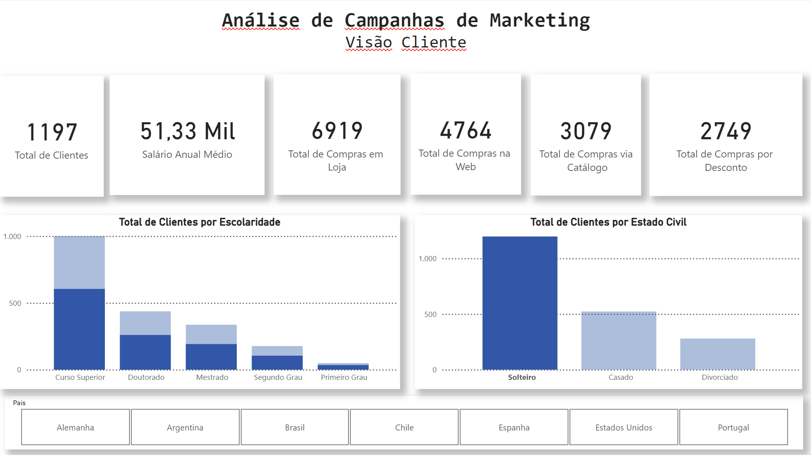
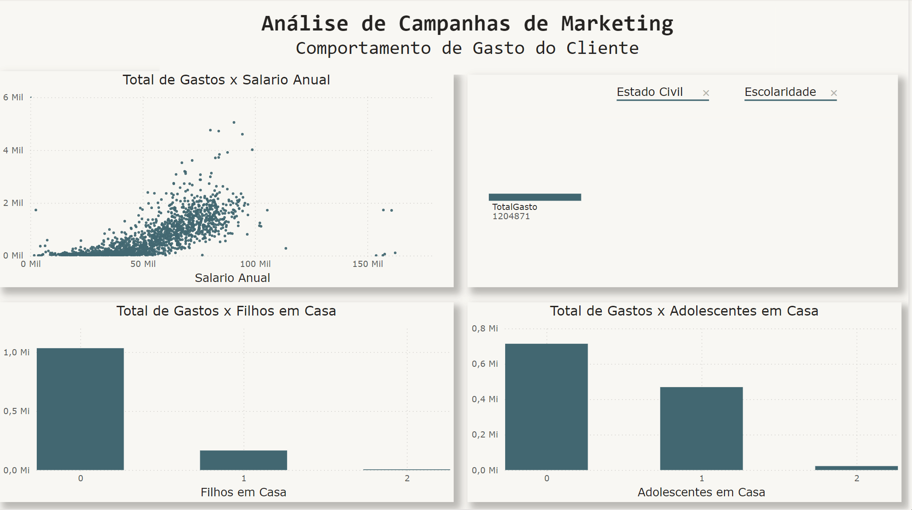
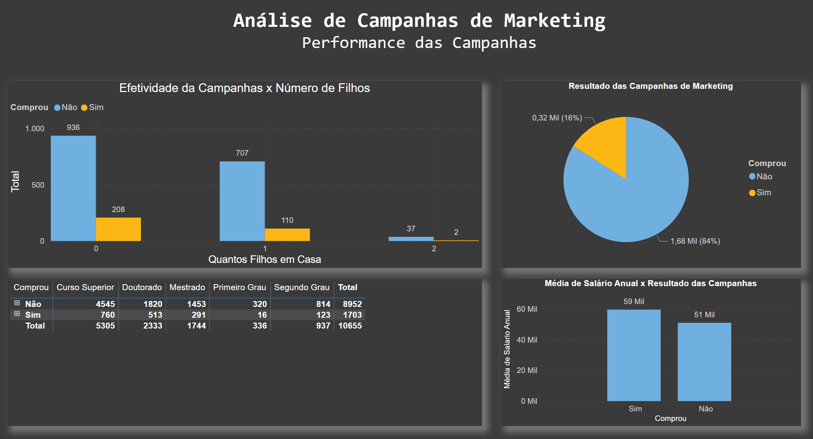
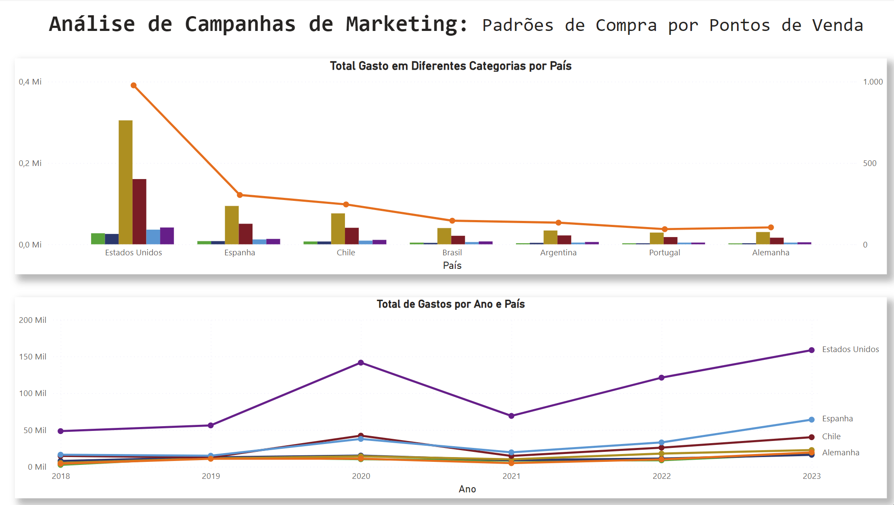
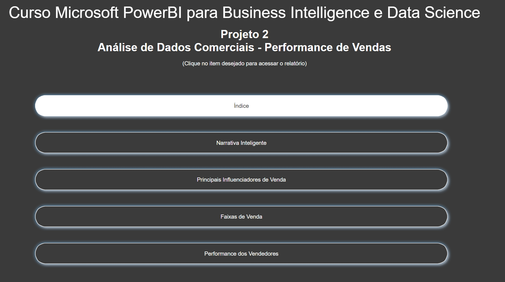
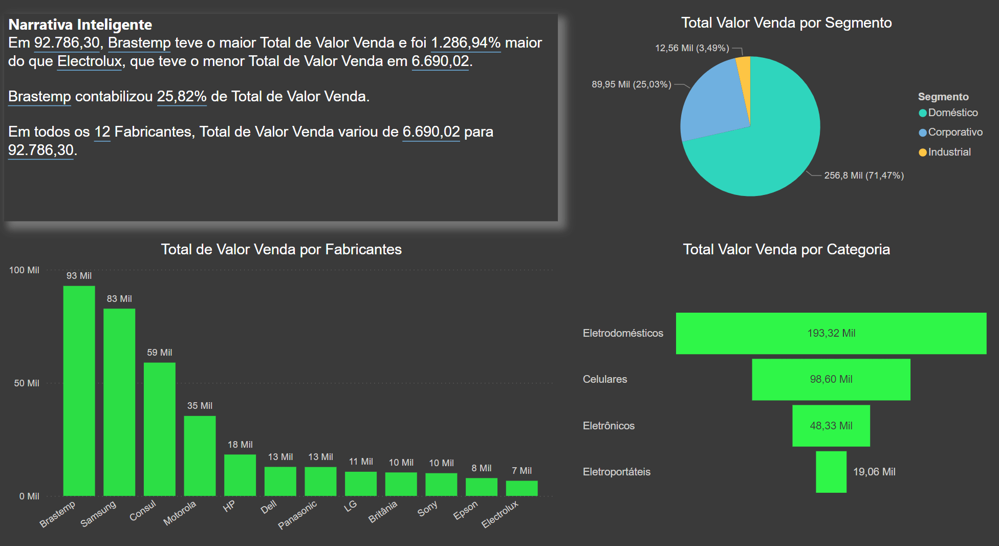
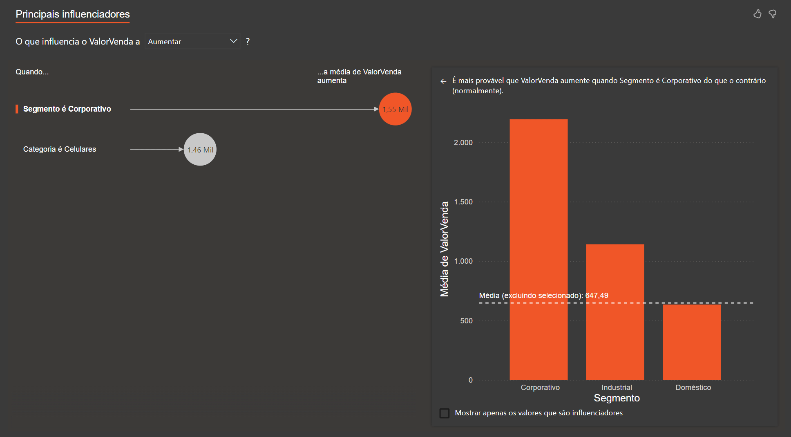
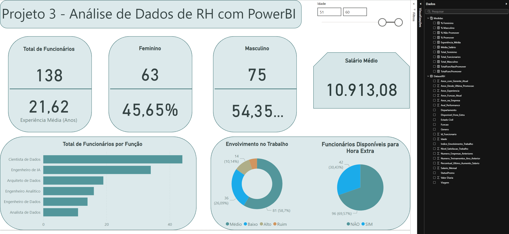
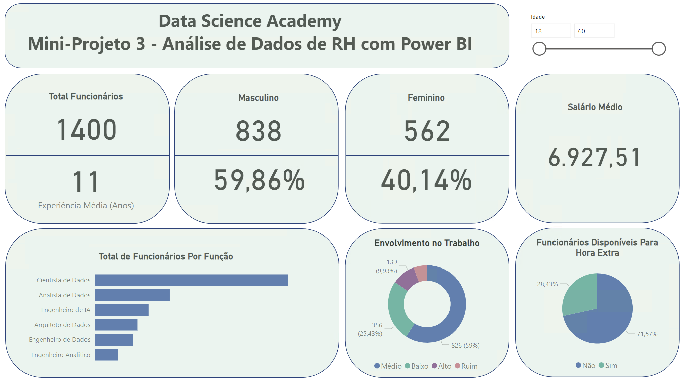

<h1 align="center">Projeto 1: Análise de Dados de Marketing</h1>

Um projeto de análise de dados para demonstrar funcionalidades do PowerBI. Dados fictícios são utilizados para analisar a efetividade de campanhas de marketing na venda de produtos. Baseado no curso "Business Intelligence e Data Science" da Data Science Academy.

O objetivo geral do projeto é gerar insights para uma equipe de marketing através de uma série de informações estruturadas no arquivo dados_marketing.csv:

- O perfil de clientes de uma empresa fictícia (idade, escolaridade, nacionalidade, número de filhos, etc);
- Os respectivos gastos de cada cliente em diferentes setores (alimentação, vestuário, utilidades, móveis, etc);
- O número de compras realizadas por via (catálogos, web, lojas físicas) e booleanos caracterizando se compras ocorreram durante determinada campanha de marketing.

São criados, portanto, diversos relatórios divididos em 4 visões:
1. Visão do Cliente;
2. Visão do Comportamento de Compra do Cliente;
3. Visão da Performance das Campanhas de Marketing;
4. Visão dos Padrões de Compra no Ponto de Venda (País)

Para cada visão trabalha-se a análise dos dados, a criação de gráficos e medidas, a extração de métricas e o cruzamento entre os dados, visando entregar aos tomadores de decisão uma visão bastante completa sobre o perfil dos clientes, os padrões de compra e a efetividade das campanhas de Marketing.

## Visão Cliente


Visão focada no perfil de 2000 clientes distintos, separados por escolaridade,, estado civil e país.
- Total de Clientes por Escolaridade: A maioria dos clientes possui curso superior, seguido por doutorado e mestrado, com menores números para segundo e primeiro grau.
- Total de Clientes por Estado Civil: A maior parte dos clientes é solteira, seguida por casados e divorciados.
- Países: quase metade do total de clientes residem nos Estados Unidos

---

## Comportamento de Gastos do Cliente


A segunda página do relatório foca no comportamento de gasto do cliente.

- Gráficos de Dispersão e Barras: o gráfico de dispersão mostra uma correlação positiva entre o salário anual e o total de gastos dos clientes. A maioria dos clientes com menor salário também tem gastos menores, enquanto aqueles com salários mais altos tendem a gastar mais.
- Filtros: há filtros para Estado Civil e Escolaridade, que possibilitam segmentar o total de gastos.
- Total de Gastos x Filhos em Casa: A maior parte do total de gastos provém de clientes que não possuem filhos em casa, seguido por aqueles com 1 ou 2 filhos.
- Total de Gastos x Adolescentes em Casa: Clientes que não têm adolescentes em casa representam a maior parte dos gastos. O gasto diminui à medida que o número de adolescentes em casa aumenta.

Esse layout oferece uma análise sobre como fatores demográficos, como a presença de filhos ou adolescentes, influenciam o comportamento de consumo dos clientes.

---

## Performance das Campanhas


A terceira página do relatório foca na performance das campanhas de marketing.

- Efetividade da Campanha x Número de Filhos: Este gráfico de barras mostra a relação entre o número de filhos em casa e a adesão à campanha (compra). Clientes sem filhos tiveram uma taxa de compra maior, enquanto a taxa de compra diminui conforme aumenta o número de filhos.
- Resultado das Campanhas de Marketing: O gráfico de pizza mostra que 84% dos clientes não compraram (1,68 mil), enquanto 16% dos clientes compraram (0,32 mil), indicando que a campanha atingiu uma minoria dos clientes.
- Compras x Escolaridade: A tabela detalha o número de compras de acordo com o nível de escolaridade. Nota-se que clientes com curso superior e doutorado estão mais presentes na categoria "Não comprou", enquanto há menor participação de pessoas com níveis educacionais mais baixos.
- Média de Salário Anual x Resultado das Campanhas: Este gráfico compara a média de salário anual entre clientes que compraram e não compraram. A média salarial dos que compraram é de 59 mil, enquanto a dos que não compraram é de 51 mil, indicando que a campanha foi mais efetiva entre aqueles com maior renda.

Esses dados fornecem uma visão sobre quais segmentos de clientes responderam melhor às campanhas e sugerem que o nível educacional e a renda são fatores que influenciam a adesão.

---

## Padrões de Compra por Ponto de Venda


A quarta e última página do relatório foca na separação de vendas e gastos por categoria nos diferentes países. 

- Total Gasto em Diferentes Categorias por País: A linha de tendência sugere que os Estados Unidos têm os maiores gastos por categoria, seguido de uma queda acentuada nos países seguintes.
- Total de Gastos por Ano e País: É um gráfico de linhas que mostra a evolução do total de gastos por ano, de 2018 a 2023, para os países contemplados. Novamente os Estados Unidos destacam-se com um crescimento contínuo e mais expressivo. Outros países, como Espanha, Chile e Alemanha, mostram uma tendência de estabilidade ou crescimento menor.

---
---
---

<h1 align="center">Projeto 2: Análise de Dados Comerciais</h1>

Um projeto de análise de dados para demonstrar funcionalidades do PowerBI, baseado no curso "Business Intelligence e Data Science" da Data Science Academy..
O arquivo Dados_Comerciais.xlsx contém uma lista de transações comerciais realizadas por uma empresa, descrevendo a venda de produtos separados por categoria, segmento comercial, loja, localização, vendedor, comissão, data da transação, valores e custos, etc.

- Este dashboard inclui um índice dinâmico, cuja funcionalidade é exibidade abaixo:

---

## Narrativa Inteligente


- A narrativa inteligente é um recurso do PowerBI que gera automaticamente um texto corrido para sublinhhar os principais pontos-chave provenientes das demais visualizações na página. Note que a filtragem dinâmica que é rotineiramente utilizada nas visualizações do PowerBI também se reflete na narrativa inteligente.

---

## Principais Influenciadores de Vendas


- O recurso visual de "Principais Influenciadores" do PowerBI automaticamente analisa o valor das vendas em função de variáveis categóricas (no caso, Categoria e Segmentos). Em poucos passos chega-se à conclusão de que o segmento "Corporativo" e a categoria de "Celulares" são os principais responsáveis por influenciar o aumento na variável "ValorVenda".
- Modificando-se o checkbox de "Aumentar" para "Diminuir" gera uma nova análise, análoga, detalhando que o segmento "Doméstico" e a categoria "Eletroportáteis" são os maiores responsáveis por influenciar a diminuição na variável "ValorVenda".
- A análise é convenientemente acompanhado de um gráfico de barras, também gerado automaticamente, o qual se adapta caso o foco da análise seja por categoria ou por segmento.

---

## Faixas de Vendas


- A visualização de Gráfico de Faixas exibe a queda (ou aumento) nas vendas de uma determinada categoria para outra em um determinado ponto de venda. Dentre outras caracaterísticas, esse gráfico possui a vantagem de detalhar instantaneamente se determinadas lojas performaram melhor em quais categorias. Essa relação nem sempre é monotônica (e.g. o ponto de venda SP8821
performa razoavelmente bem na venda de Eletrodomésticos, em terceiro lugar dentre as lojas, mas falha grosseiramente na venda de celulares).
- É relevante observar que estas mesmas informações poderiam ser dispostas de forma tabular com a visualização matricial. O gráfico de faixas, porém, provê um auxílio visual ao destacar as diferentes proporções no volume de vendas entre as categorias de produtos. Mais do que isso, a funcionalidade do "Controle Deslizante" permite ao usuário customizar a visualização,
caso seja necessário, por exemplo, investigar as variações para lojas cujo volume de vendas é muito menor comparada àquelas que dominam o mercado.

---

## Performance dos Vendedores por Região


Por fim, a visualização por mapa permite investigar informações de venda por Estados ou Cidades. No caso, vendas de determinados vendedores são exibidos para certos estados. Um filtro dinâmico pode ser aplicado caso queiramos discernir, por exemplo, quais foram os vendedores cujo volume de vendas excedeu 30000 unidades.

---
---
---

<h1 align="center">Projeto 3: Análise de Dados de RH</h1>

Um projeto de análise de dados para demonstrar funcionalidades do PowerBI, baseado no curso "Business Intelligence e Data Science" da Data Science Academy.
O arquivo DatasetRH.csv contém as características de funcionários fornecidos pelo setor RH de uma empresa: gênero, idade, salário, anos sem promoção, etc.

## Foco do projeto
O objetivo deste projeto é focar na manipulação dos dados com o editor do PowerQuery e o uso de expressões DAX. Novas colunas condicionais são criadas para auxiliar na produção de visualizações, bem como
medidas de interesse (as quais ao final do projeto configuram uma nova tabela, "Medidas"). As atividades reforçam a vantagem de se manter uma série de medidas arquivadas, para uso quando necessário, ao invés
da simples visualização instantânea no dashboard. A sintaxe DAX oferece uma série de funções para os mais diversos tipos de cálculo: AVERAGE, DIVIDE, CALCULATE, COUNTROWS, etc; a sintaxe de uso é similar a de
outras bibliotecas de análise e tratamento de dados, como Pandas, embora a interface gráfica remeta ao Excel clássico.

## Visualização única


Como não há necessidade de storytelling para as informações fornecidas neste contexto, opta-se por um único dashboard, com informações-chave dispostas em diferentes cartões. Poucos gráficos de baixa complexidade
podem coexistir nesse ambiente único sem poluir muito a visualização. Destaca-se também a versatilidade da formatação visual no PowerBI: com alguns poucos cliques pode-se alterar raoidamente a disposição entre
os elementos, ou a paleta de cores utilizada. Um dashboard com as mesmas informações e formatação similar é exibido abaixo:



---
---
---

<h1 align="center">Projeto 4: Análise de Dados de Logística</h1>


Um projeto de análise de dados para demonstrar funcionalidades do PowerBI, baseado no curso "Business Intelligence e Data Science" da Data Science Academy.

Este projeto foca em solucionar os problemas de um dashboard .pbix construído previamente por um analista de dados sem experiência.

<div align="center">
  
  
</div>

---

## Resolução

O Dashboard precisava mostrar os seguintes KPIs de Logística:
1. Total de Entregas no Prazo Por Canal de Entrega
2. Percentual de Entregas Antecipadas Por Equipede Entrega
3. Total de Entregas Por Mês
4. Total de Entregas de Produtos dos Top5 Vendedores
5. Total de Entregas com Atraso Por Cidade
6. Percentual de Entregas Por Status de Entrega

---

## Total de Entregas no Prazo Por Canal de Entrega
- A informação está errada. É necessário substituir "Contagem de StatusEntregas" pelo Total de Entregas, definido como uma nova medida utilizando COUNTROWS na tabela Logística (para garantir a independência da variável)

---

## Percentual de Entregas Antecipadas Por Equipede Entrega

- Problema de legibilidade (muitas categorias). É necessário substituir a visualização por uma que permita muitas (>5) categorias, como Treemap ou, no caso, um simples gráfico de barras horizontais (preferível devido à discrepância entre os valores de entregas por equipes).
  
---

## Total de Entregas Por Mês

- A escala de tempo não é mensal e precisa ser corrigida. Isso pode ser solucionado utilizando-se a hierarquia de datas da variável "DataEntregaRealizada", identificada pelo PowerBI como variável do tipo Calendário.

---

## Total de Entregas de Produtos dos Top5 Vendedores

- Problema de legibilidade (muitas categorias); não houve a filtragem pelos top 5 vendedores. Basta aplicar o filtro.
- Ainda assim, a análise é comprometida devido aos valores semelhantes de venda para os 5 vendedores. O gráfico de rosca, portanto, não é apropriado neste contexto. Um gráfico de funil, por exemplo, seria mais adequado.
- De qualquer forma, é conveniente deixar a informação em formato tabular, devido à utilidade da classificação (rating).

---

## Total de Entregas com Atraso Por Cidade

- A escolha do grafico de barras verticais não foi ideal, dado o grande número de cidades contempladas. A legenda desnecessariamente inclui as categorias "antecipado" e "no prazo". Há problemas de formatação que precisam ser corrigidos.
- Um mapa poderia ser uma escolha interessante, mas nesse caso específico as cidades são categorizadas por número, sem valor real para serem implementadas cartograficamente. Resta a nós dispor os dados em formato tabular, aplicando o filtro de entregas atrasadas.

---

## Percentual de Entregas Por Status de Entrega

- Os dados não estão formatados em porcentagem. Uma simples correção nas configurações da visualização do gráfico de barras resolve este item.

---

Por fim, podemos aprimorar algumas visualizações. A tabela de "Total de Entregas de Produtos dos Top5 Vendedores" pode ser aprimorada com uma classificação (rating), uma das "medidas rápidas" implementadas no PowerBI, que gozam desta funcionalidade por configurarem expressões DAX mais complexas e (geralmente) verbosas, como visualizado abaixo


Podemos também aplicar filtros utilizando expressões DAX, o que é conveniente neste cenário para calcular, por exemplo, o número de entregas _*dentro do prazo*_, ou seja, aquelas que foram classificadas tanto como "Antecipadas" ou "No Prazo". A expressão utilizada para o calculo desta nova medida é:

"TotalEntregasNoPrazo = CALCULATE([TotalEntregas],FILTER(Logistica, Logistica[Status_Entrega] = "Antecipado" || Logistica[Status_Entrega] = "No Prazo"))"

---

Eis o resultado final:

<div align="center">
  
</div>

Todas as modificações e reparos resultam no dashboard final abaixo. Apesar do grande número de elementos, as diferentes informações conseguem ser transmitidas de forma concisa, simples e não-poluída. São implementados diversos novos recursos:
1. A barra de rolagem na tabela permite que as informações das diferentes cidades sejam inspecionadas sem que a informação domine o dashboard.
2. A classificação dos 5 melhores vendedores fornece um auxílio visual para que não seja necessário, em primeiro momento, fazer esta avaliação a partir dos números (grandes) exibidos, seja o id dos vendedores quando o total de entregas.
3. Novamente, cartões são úteis para exibir as informações mais relevantes imediatamente. A escolha do canto superior esquerdo é proposital.
4. Gráficos de pizza e rosca são sintetizados em outros formatos, mais adequados para o grande número de categorias contempladas.
5. Fintalmente, um segmentador por ano é exibido no canto superior direito, permitindo uma visualização imediata da evolução do setor logístico em grande escala temporal.

---
---
---

<h1 align="center">Projeto 5: Análise de Dados Financeiros</h1>

# PowerBI_Projeto5_Fintech

Um projeto de análise de dados para demonstrar funcionalidades do PowerBI, baseado no curso "Business Intelligence e Data Science" da Data Science Academy. O foco, desta vez, é a área de finanças.


## Contexto

Algumas das principais funções da área de finanças de uma empresa incluem:

1. Planejamento  financeiro:  essa  função  envolve  a  criação  de  um  plano  financeiro estratégico para a empresa, que define como a empresa irá alocar seus recursos financeiros para atingir seus objetivos.
2. Controle financeiro: a área de finanças deve monitorar constantemente os fluxos de caixa, as receitas e as despesas da empresa para garantir que ela esteja operando dentro de seu orçamento e prevendo possíveis desvios.
3. Gerenciamento de riscos: a área de finanças deve avaliar e gerenciar os riscos financeiros da empresa, como riscos de mercado, de crédito e de liquidez.
4. Tomada de decisões financeiras: a área de finanças deve fornecer informações e análises financeiras  para  ajudar  a  empresa  a tomar  decisões  importantes,  como  investir  em  novos projetos, fazer aquisições ou buscar financiamento externo.
5. Relacionamento  com  investidores:  a  área  de  finanças  também  é  responsável  por gerenciar o relacionamento com os investidores, divulgando informações financeiras e ajudando a construir a confiança do mercado na empresa.

Neste contexto, KPIs (Indicadores-Chave de Performance) são métricas importantes que a área de finanças pode usar para monitorar o desempenho financeiro de uma empresa. A seguir estão alguns dos principais KPIs 
da área de finanças:

1. Fluxo de caixa: é uma medida do dinheiro que entra e sai da empresa em um determinado período de tempo. O fluxo de caixa positivo é um sinal de que a empresa está gerando receita suficiente para cobrir suas despesas.
2. Margem de lucro: é a porcentagem de lucro que a empresa ganha em cada venda. Ela pode ser calculada dividindo o lucro líquido pela receita total.
3. Retorno  sobre  o  investimento  (ROI):  é  uma  medida  do  retorno  que  a  empresa  está obtendo de seus investimentos. O ROI pode ser calculado dividindo o lucro pelo investimento inicial.
4. Endividamento: é a medida da quantidade de dívida que a empresa tem em relação ao seu patrimônio líquido. Ele pode ser calculado dividindo a dívida total pelo patrimônio líquido.
5. Faturamento:  é  a  receita  total  que  a  empresa  gera  em  um  determinado  período  de tempo.
6. Custo de aquisição de clientes (CAC): é a quantidade de dinheiroque a empresa gasta para adquirir cada novo cliente. Ele pode ser calculado dividindo o custo total de marketing e vendas pelo número de novos clientes.
7. Prazo médio de pagamento (PMP): é o tempo médio que a empresa leva para pagar seus fornecedores. Ele pode ser calculado dividindo o valor total das compras pelo valor total pago a fornecedores em um determinado período de tempo.

Estes são apenas alguns dos KPIs mais comuns da área de finanças, mas existem muitos outros que podem ser relevantes dependendodas necessidades e objetivos específicos de cada empresa.

---

## Inspeção Inicial

Os dados, provenientes em formato xlsx, sugerem imediatamente a necessidade de uma transformação inicial, para que os atributos (componentes) sejam organizados em colunas e os valores em si - balizados por uma data calendário - sejam dispostos em linhas tal qual o padrão de séries temporais.


Essa transformação, espécie de _faux_ pivô, pode ser realizada diretamente no PowerBI com uma expressão DAX somada à função UnpivotOtherColumns:

`= Table.UnpivotOtherColumns(#"Tipo Alterado1", {"Tipo","Componente"}, "Data", "Valor")`

Essa função recebe uma tabela e "desfaz a pivotagem" de todas as colunas, exceto as que você especificar, transformando efetivamente dados no formato _wide_ em dados no formato _narrow_.

Argumentos:
1. #"Tipo Alterado1": Essa é a tabela de entrada que já passou por alguma transformação anterior (provavelmente renomeada como "Tipo Alterado1" pelo Power Query).
2. {"Tipo", "Componente"}: Essas são as colunas que não serão desfazidas (unpivoted). Elas serão mantidas como estão e atuarão como chaves ou identificadores na tabela transformada.
3. "Data": Isso se torna o nome da nova coluna que conterá os cabeçalhos das colunas que foram desfazidas.
4. "Valor": Isso se torna o nome da nova coluna que conterá os valores correspondentes às colunas desfazidas.

<div align="center">
  
</div>

Agora sim, os dados estão prontos para serem trabalhados nas visualizações do dashboard.

---

Seguindo o "manual de boas práticas do PowerBI", uma nova tabela é criada manualmente para armazenar as diversas medidas que serão úteis ao longo da construção das visualizações. Os cálculos do Total de Receitas, Total de Despesas, Lucro e Margem de Lucro são todos definidos em expressões DAX:

```
TotalReceitas = CALCULATE(SUM(DadosFinanceiros[Valor]),DadosFinanceiros[Tipo]="Receitas")
TotalDespesas = CALCULATE(SUM(DadosFinanceiros[Valor]),DadosFinanceiros[Tipo]="Despesas")
Lucro = [TotalReceitas] - [TotalDespesas]
MargemLucro = DIVIDE([Lucro], [TotalReceitas], 0)
```

 O exercício pede, além da visualização do total de receitas/despesas por componente, a exibição explícita da hierarquia formada pelas variáveis qualitativas Tipo e Componente, bem como a distinção por ano (hierarquia da variável calendário "Data"). Utiliza-se uma combinação, portanto, de gráfico de barra, gráfico de área, e uma matriz (particularmente útil na discrição de hierarquias).
 
 Resta examinar quais são os principais segmentos onde Receitas e Despesas são maiores e menores para que a empresa possa traçar seu plano estratégico. Este tipo de análise poderia - caso houvesse um grande
 volume de dados disponível - ser beneficiada por um mecanismo de clusterização com aprendizado de máquina. O PowerBI, contudo, oferece a ferramenta de "Principais Influenciadores", a qual realiza uma análise
 semelhante (porém definitivamente menos rebuscada) por debaixo do capô. É incluída nesta visualização o descritor "Principais Segmentos", o qual responde a pergunta postulada pela empresa. Este recurso, IMHO, é a verdadeira _pièce de résistance_ dentre as visualizações do PowerBI: ele une a narrativa inteligente à análise de determinada variável quantitativa, explicada por uma ou mais variáveis categóricas, utilizando demais artifícios como gráficos de rosca e/ou barras internamente. Veja abaixo:

<div align="center">
  
</div>

---

O dashboard final é exibido abaixo, reunindo os diversos KPI's construídos com as expressões DAX, os gráficos estáticos, a matriz com hierarquias e o visualizador de Principais Segmentos, o qual ganha um destaque
maior graças a sua versatilidade.

<div align="center">
  
</div>

---
---
---

<h1 align="center">Projeto 6: Análise de Dados de Contabilidade</h1>


