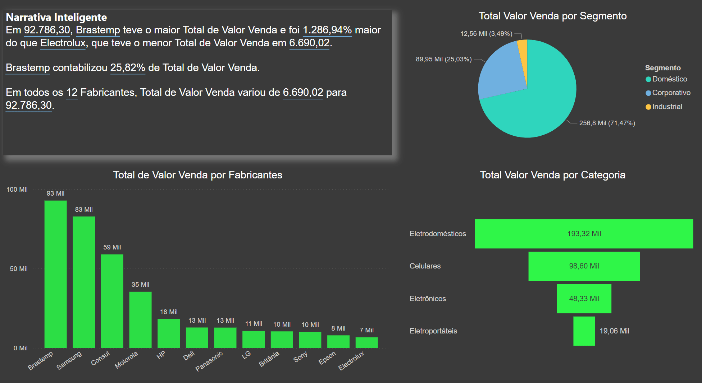

# PowerBI_projeto_comercial

Um projeto de análise de dados para demonstrar funcionalidades do PowerBI, baseado no curso "Business Intelligence e Data Science" da Data Science Academy..
O arquivo Dados_Comerciais.xlsx contém uma lista de transações comerciais realizadas por uma empresa, descrevendo a venda de produtos separados por categoria, segmento comercial, loja, localização, vendedor, comissão, data da transação, valores e custos, etc.

- Este dashboard inclui um índice dinâmico, cuja funcionalidade é exibidade abaixo:

---

## Narrativa Inteligente

- A narrativa inteligente é um recurso do PowerBI que gera automaticamente um texto corrido para sublinhhar os principais pontos-chave provenientes das demais visualizações na página. Note que a filtragem dinâmica que é rotineiramente utilizada nas visualizações do PowerBI também se reflete na narrativa inteligente.

---

## Principais Influenciadores de Vendas

- O recurso visual de "Principais Influenciadores" do PowerBI automaticamente analisa o valor das vendas em função de variáveis categóricas (no caso, Categoria e Segmentos). Em poucos passos chega-se à conclusão de que o segmento "Corporativo" e a categoria de "Celulares" são os principais responsáveis por influenciar o aumento na variável "ValorVenda".
- Modificando-se o checkbox de "Aumentar" para "Diminuir" gera uma nova análise, análoga, detalhando que o segmento "Doméstico" e a categoria "Eletroportáteis" são os maiores responsáveis por influenciar a diminuição na variável "ValorVenda".
- A análise é convenientemente acompanhado de um gráfico de barras, também gerado automaticamente, o qual se adapta caso o foco da análise seja por categoria ou por segmento.

---

## Faixas de Vendas

- A visualização de Gráfico de Faixas exibe a queda (ou aumento) nas vendas de uma determinada categoria para outra em um determinado ponto de venda. Dentre outras caracaterísticas, esse gráfico possui a vantagem de detalhar instantaneamente se determinadas lojas performaram melhor em quais categorias. Essa relação nem sempre é monotônica (e.g. o ponto de venda SP8821
performa razoavelmente bem na venda de Eletrodomésticos, em terceiro lugar dentre as lojas, mas falha grosseiramente na venda de celulares).
- É relevante observar que estas mesmas informações poderiam ser dispostas de forma tabular com a visualização matricial. O gráfico de faixas, porém, provê um auxílio visual ao destacar as diferentes proporções no volume de vendas entre as categorias de produtos. Mais do que isso, a funcionalidade do "Controle Deslizante" permite ao usuário customizar a visualização,
caso seja necessário, por exemplo, investigar as variações para lojas cujo volume de vendas é muito menor comparada àquelas que dominam o mercado.

---

## Performance dos Vendedores por Região

Por fim, a visualização por mapa permite investigar informações de venda por Estados ou Cidades. No caso, vendas de determinados vendedores são exibidos para certos estados. Um filtro dinâmico pode ser aplicado caso queiramos discernir, por exemplo, quais foram os vendedores cujo volume de vendas excedeu 30000 unidades.
