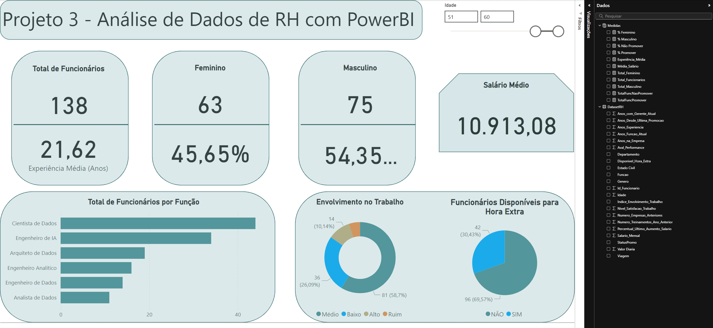

# PowerBI - Projeto Dados RH

Um projeto de análise de dados para demonstrar funcionalidades do PowerBI, baseado no curso "Business Intelligence e Data Science" da Data Science Academy.
O arquivo DatasetRH.csv contém as características de funcionários fornecidos pelo setor RH de uma empresa: gênero, idade, salário, anos sem promoção, etc.

## Foco do projeto
O objetivo deste projeto é focar na manipulação dos dados com o editor do PowerQuery e o uso de expressões DAX. Novas colunas condicionais são criadas para auxiliar na produção de visualizações, bem como
medidas de interesse (as quais ao final do projeto configuram uma nova tabela, "Medidas"). As atividades reforçam a vantagem de se manter uma série de medidas arquivadas, para uso quando necessário, ao invés
da simples visualização instantânea no dashboard. A sintaxe DAX oferece uma série de funções para os mais diversos tipos de cálculo: AVERAGE, DIVIDE, CALCULATE, COUNTROWS, etc; a sintaxe de uso é similar a de
outras bibliotecas de análise e tratamento de dados, como Pandas, embora a interface gráfica remeta ao Excel clássico.

## Visualização única

Como não há necessidade de storytelling para as informações fornecidas neste contexto, opta-se por um único dashboard, com informações-chave dispostas em diferentes cartões. Poucos gráficos de baixa complexidade
podem coexistir nesse ambiente único sem poluir muito a visualização. Destaca-se também a versatilidade da formatação visual no PowerBI: com alguns poucos cliques pode-se alterar raoidamente a disposição entre
os elementos, ou a paleta de cores utilizada. Um dashboard com as mesmas informações e formatação similar é exibido abaixo:

---

