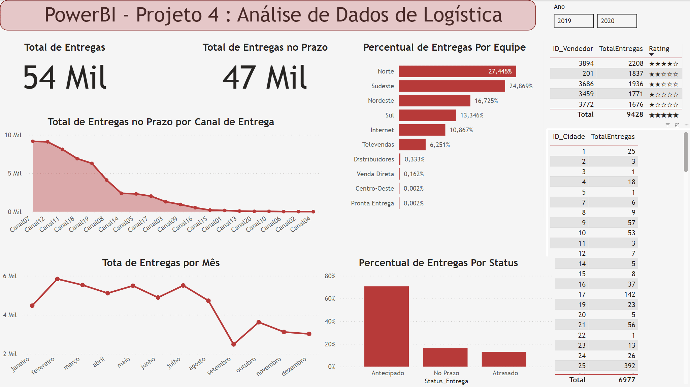

# PowerBI - Projeto Dados Logísticas

Um projeto de análise de dados para demonstrar funcionalidades do PowerBI, baseado no curso "Business Intelligence e Data Science" da Data Science Academy.

Este projeto foca em solucionar os problemas de um dashboard .pbix construído previamente por um analista de dados sem experiência.

  
  

---

## Resolução

O Dashboard precisava mostrar os seguintes KPIs de Logística:
1. Total de Entregas no Prazo Por Canal de Entrega
2. Percentual de Entregas Antecipadas Por Equipede Entrega
3. Total de Entregas Por Mês
4. Total de Entregas de Produtos dos Top5 Vendedores
5. Total de Entregas com Atraso Por Cidade
6. Percentual de Entregas Por Status de Entrega

---

## Total de Entregas no Prazo Por Canal de Entrega
- A informação está errada. É necessário substituir "Contagem de StatusEntregas" pelo Total de Entregas, definido como uma nova medida utilizando COUNTROWS na tabela Logística (para garantir a independência da variável)

---

## Percentual de Entregas Antecipadas Por Equipede Entrega

- Problema de legibilidade (muitas categorias). É necessário substituir a visualização por uma que permita muitas (>5) categorias, como Treemap ou, no caso, um simples gráfico de barras horizontais (preferível devido à discrepância entre os valores de entregas por equipes).
  
---

## Total de Entregas Por Mês

- A escala de tempo não é mensal e precisa ser corrigida. Isso pode ser solucionado utilizando-se a hierarquia de datas da variável "DataEntregaRealizada", identificada pelo PowerBI como variável do tipo Calendário.

---

## Total de Entregas de Produtos dos Top5 Vendedores

- Problema de legibilidade (muitas categorias); não houve a filtragem pelos top 5 vendedores. Basta aplicar o filtro.
- Ainda assim, a análise é comprometida devido aos valores semelhantes de venda para os 5 vendedores. O gráfico de rosca, portanto, não é apropriado neste contexto. Um gráfico de funil, por exemplo, seria mais adequado.
- De qualquer forma, é conveniente deixar a informação em formato tabular, devido à utilidade da classificação (rating).

---

## Total de Entregas com Atraso Por Cidade

- A escolha do grafico de barras verticais não foi ideal, dado o grande número de cidades contempladas. A legenda desnecessariamente inclui as categorias "antecipado" e "no prazo". Há problemas de formatação que precisam ser corrigidos.
- Um mapa poderia ser uma escolha interessante, mas nesse caso específico as cidades são categorizadas por número, sem valor real para serem implementadas cartograficamente. Resta a nós dispor os dados em formato tabular, aplicando o filtro de entregas atrasadas.

---

## Percentual de Entregas Por Status de Entrega

- Os dados não estão formatados em porcentagem. Uma simples correção nas configurações da visualização do gráfico de barras resolve este item.

---

Por fim, podemos aprimorar algumas visualizações. A tabela de "Total de Entregas de Produtos dos Top5 Vendedores" pode ser aprimorada com uma classificação (rating), uma das "medidas rápidas" implementadas no PowerBI, que gozam desta funcionalidade por configurarem expressões DAX mais complexas e (geralmente) verbosas, como visualizado abaixo

Podemos também aplicar filtros utilizando expressões DAX, o que é conveniente neste cenário para calcular, por exemplo, o número de entregas _*dentro do prazo*_, ou seja, aquelas que foram classificadas tanto como "Antecipadas" ou "No Prazo". A expressão utilizada para o calculo desta nova medida é:

"TotalEntregasNoPrazo = CALCULATE([TotalEntregas],FILTER(Logistica, Logistica[Status_Entrega] = "Antecipado" || Logistica[Status_Entrega] = "No Prazo"))"

---

Eis o resultado final:

  

Todas as modificações e reparos resultam no dashboard final abaixo. Apesar do grande número de elementos, as diferentes informações conseguem ser transmitidas de forma concisa, simples e não-poluída. São implementados diversos novos recursos:
1. A barra de rolagem na tabela permite que as informações das diferentes cidades sejam inspecionadas sem que a informação domine o dashboard.
2. A classificação dos 5 melhores vendedores fornece um auxílio visual para que não seja necessário, em primeiro momento, fazer esta avaliação a partir dos números (grandes) exibidos, seja o id dos vendedores quando o total de entregas.
3. Novamente, cartões são úteis para exibir as informações mais relevantes imediatamente. A escolha do canto superior esquerdo é proposital.
4. Gráficos de pizza e rosca são sintetizados em outros formatos, mais adequados para o grande número de categorias contempladas.
5. Fintalmente, um segmentador por ano é exibido no canto superior direito, permitindo uma visualização imediata da evolução do setor logístico em grande escala temporal.

