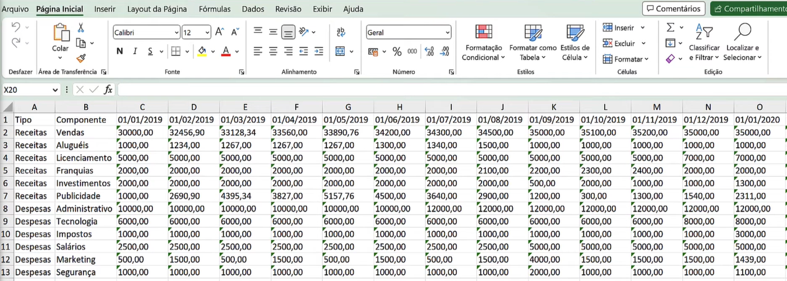
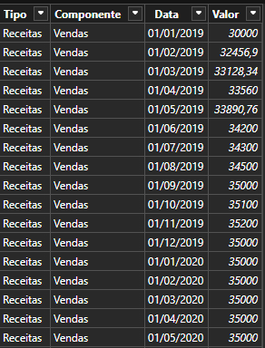
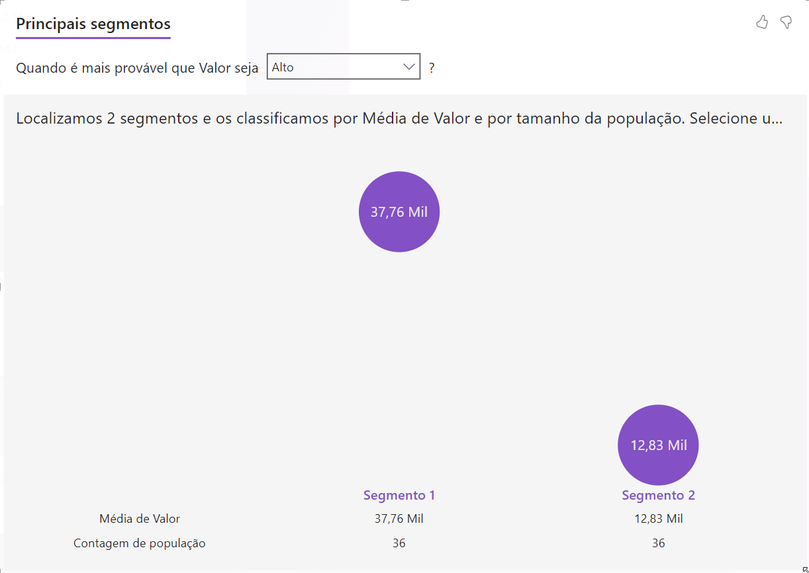
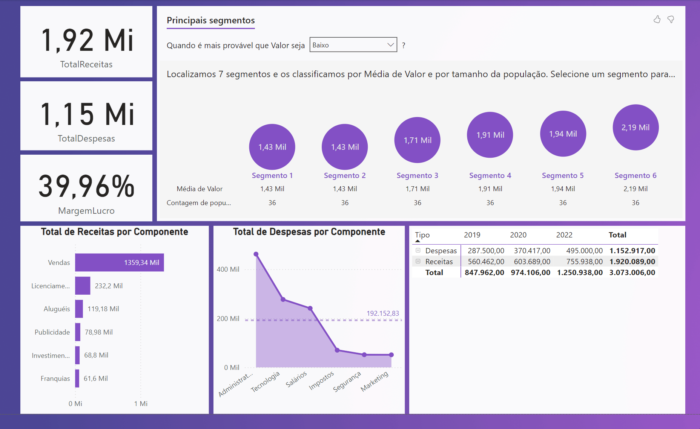

# PowerBI_Projeto5_Fintech

Um projeto de análise de dados para demonstrar funcionalidades do PowerBI, baseado no curso "Business Intelligence e Data Science" da Data Science Academy. O foco, desta vez, é a área de finanças.


## Contexto

Algumas das principais funções da área de finanças de uma empresa incluem:

1. Planejamento  financeiro:  essa  função  envolve  a  criação  de  um  plano  financeiro estratégico para a empresa, que define como a empresa irá alocar seus recursos financeiros para atingir seus objetivos.
2. Controle financeiro: a área de finanças deve monitorar constantemente os fluxos de caixa, as receitas e as despesas da empresa para garantir que ela esteja operando dentro de seu orçamento e prevendo possíveis desvios.
3. Gerenciamento de riscos: a área de finanças deve avaliar e gerenciar os riscos financeiros da empresa, como riscos de mercado, de crédito e de liquidez.
4. Tomada de decisões financeiras: a área de finanças deve fornecer informações e análises financeiras  para  ajudar  a  empresa  a tomar  decisões  importantes,  como  investir  em  novos projetos, fazer aquisições ou buscar financiamento externo.
5. Relacionamento  com  investidores:  a  área  de  finanças  também  é  responsável  por gerenciar o relacionamento com os investidores, divulgando informações financeiras e ajudando a construir a confiança do mercado na empresa.

Neste contexto, KPIs (Indicadores-Chave de Performance) são métricas importantes que a área de finanças pode usar para monitorar o desempenho financeiro de uma empresa. A seguir estão alguns dos principais KPIs 
da área de finanças:

1. Fluxo de caixa: é uma medida do dinheiro que entra e sai da empresa em um determinado período de tempo. O fluxo de caixa positivo é um sinal de que a empresa está gerando receita suficiente para cobrir suas despesas.
2. Margem de lucro: é a porcentagem de lucro que a empresa ganha em cada venda. Ela pode ser calculada dividindo o lucro líquido pela receita total.
3. Retorno  sobre  o  investimento  (ROI):  é  uma  medida  do  retorno  que  a  empresa  está obtendo de seus investimentos. O ROI pode ser calculado dividindo o lucro pelo investimento inicial.
4. Endividamento: é a medida da quantidade de dívida que a empresa tem em relação ao seu patrimônio líquido. Ele pode ser calculado dividindo a dívida total pelo patrimônio líquido.
5. Faturamento:  é  a  receita  total  que  a  empresa  gera  em  um  determinado  período  de tempo.
6. Custo de aquisição de clientes (CAC): é a quantidade de dinheiroque a empresa gasta para adquirir cada novo cliente. Ele pode ser calculado dividindo o custo total de marketing e vendas pelo número de novos clientes.
7. Prazo médio de pagamento (PMP): é o tempo médio que a empresa leva para pagar seus fornecedores. Ele pode ser calculado dividindo o valor total das compras pelo valor total pago a fornecedores em um determinado período de tempo.

Estes são apenas alguns dos KPIs mais comuns da área de finanças, mas existem muitos outros que podem ser relevantes dependendodas necessidades e objetivos específicos de cada empresa.

---

## Inspeção Inicial

Os dados, provenientes em formato xlsx, sugerem imediatamente a necessidade de uma transformação inicial, para que os atributos (componentes) sejam organizados em colunas e os valores em si - balizados por uma data calendário - sejam dispostos em linhas tal qual o padrão de séries temporais.



Essa transformação, espécie de _faux_ pivô, pode ser realizada diretamente no PowerBI com uma expressão DAX somada à função UnpivotOtherColumns:

`= Table.UnpivotOtherColumns(#"Tipo Alterado1", {"Tipo","Componente"}, "Data", "Valor")`

Essa função recebe uma tabela e "desfaz a pivotagem" de todas as colunas, exceto as que você especificar, transformando efetivamente dados no formato _wide_ em dados no formato _narrow_.

Argumentos:
1. #"Tipo Alterado1": Essa é a tabela de entrada que já passou por alguma transformação anterior (provavelmente renomeada como "Tipo Alterado1" pelo Power Query).
2. {"Tipo", "Componente"}: Essas são as colunas que não serão desfazidas (unpivoted). Elas serão mantidas como estão e atuarão como chaves ou identificadores na tabela transformada.
3. "Data": Isso se torna o nome da nova coluna que conterá os cabeçalhos das colunas que foram desfazidas.
4. "Valor": Isso se torna o nome da nova coluna que conterá os valores correspondentes às colunas desfazidas.

<div align="center">
  
</div>

Agora sim, os dados estão prontos para serem trabalhados nas visualizações do dashboard.

---

Seguindo o "manual de boas práticas do PowerBI", uma nova tabela é criada manualmente para armazenar as diversas medidas que serão úteis ao longo da construção das visualizações. Os cálculos do Total de Receitas, Total de Despesas, Lucro e Margem de Lucro são todos definidos em expressões DAX:

```
TotalReceitas = CALCULATE(SUM(DadosFinanceiros[Valor]),DadosFinanceiros[Tipo]="Receitas")
TotalDespesas = CALCULATE(SUM(DadosFinanceiros[Valor]),DadosFinanceiros[Tipo]="Despesas")
Lucro = [TotalReceitas] - [TotalDespesas]
MargemLucro = DIVIDE([Lucro], [TotalReceitas], 0)
```

 O exercício pede, além da visualização do total de receitas/despesas por componente, a exibição explícita da hierarquia formada pelas variáveis qualitativas Tipo e Componente, bem como a distinção por ano (hierarquia da variável calendário "Data"). Utiliza-se uma combinação, portanto, de gráfico de barra, gráfico de área, e uma matriz (particularmente útil na discrição de hierarquias).
 
 Resta examinar quais são os principais segmentos onde Receitas e Despesas são maiores e menores para que a empresa possa traçar seu plano estratégico. Este tipo de análise poderia - caso houvesse um grande
 volume de dados disponível - ser beneficiada por um mecanismo de clusterização com aprendizado de máquina. O PowerBI, contudo, oferece a ferramenta de "Principais Influenciadores", a qual realiza uma análise
 semelhante (porém definitivamente menos rebuscada) por debaixo do capô. É incluída nesta visualização o descritor "Principais Segmentos", o qual responde a pergunta postulada pela empresa. Este recurso, IMHO, é a verdadeira _pièce de résistance_ dentre as visualizações do PowerBI: ele une a narrativa inteligente à análise de determinada variável quantitativa, explicada por uma ou mais variáveis categóricas, utilizando demais artifícios como gráficos de rosca e/ou barras internamente. Veja abaixo:

<div align="center">
  
</div>

---

O dashboard final é exibido abaixo, reunindo os diversos KPI's construídos com as expressões DAX, os gráficos estáticos, a matriz com hierarquias e o visualizador de Principais Segmentos, o qual ganha um destaque
maior graças a sua versatilidade.

<div align="center">
  
</div>